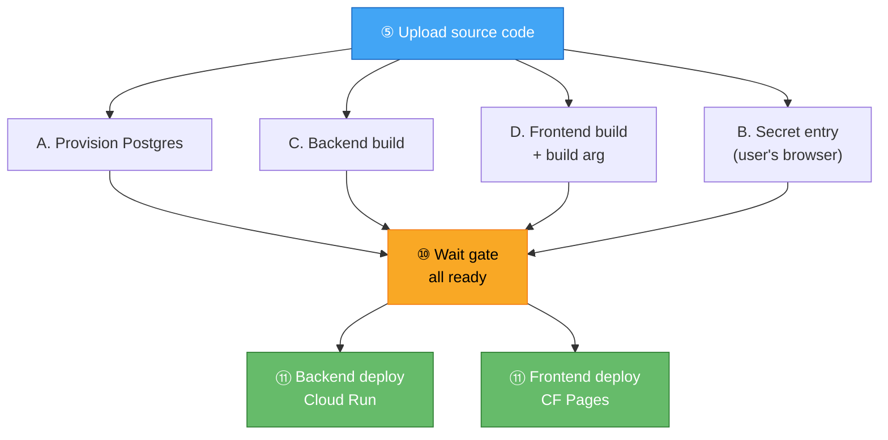
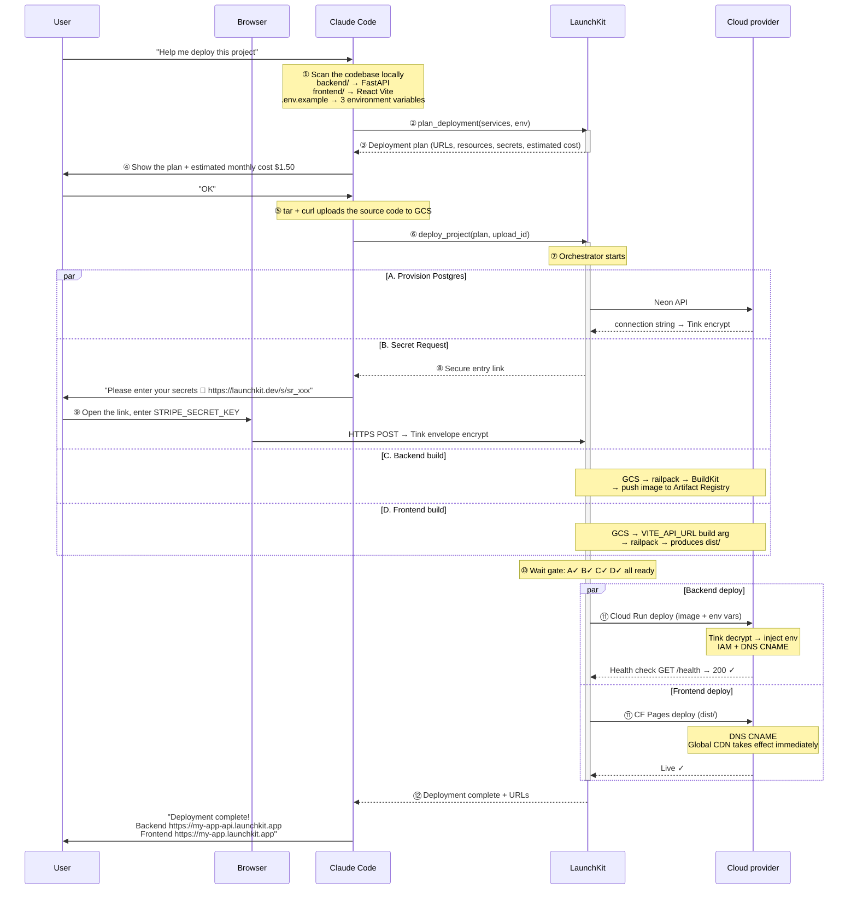
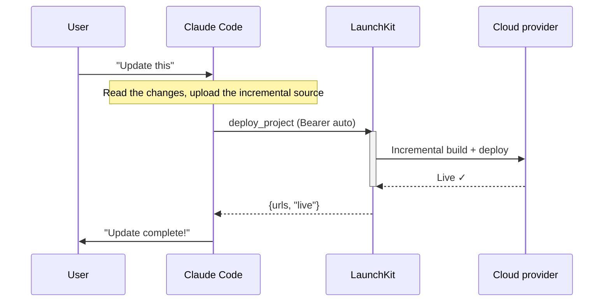

# LaunchKit — Complete User Flow Design

> **Positioning**: tell the AI "publish this", and 3 minutes later the app is live and earning money.
>
> **Target user**: Vibe coder (non-technical background, writes code with AI, does not know how to deploy)
>
> **Core mindset**:
> - Users do not need to know what a server, database, or environment variable is
> - Users do not need to pick a plan, compare pricing, or configure DNS
> - Users only need to say "publish this" and leave the rest to the AI
>
> **Long-term vision**: an automatic publishing protocol for the Agent-to-Agent era
> **Phase 1 focus**: indie developers writing SaaS with AI, going live at lightning speed and starting to earn
> **Monetization core**: GPU training/inference (50%+ margin) + cloud cost markup (30-50%)

---

## 0. First-Time User Flow

LaunchKit is a **Remote HTTP MCP Server** that follows the OAuth 2.1 authentication flow of the MCP specification.
Users do not need to install anything: no npm install, no CLI. They only need to add one line of configuration.

### Step 0: Add the MCP Server (one-time)

The user runs in Claude Code:

```bash
claude mcp add --transport http launchkit https://mcp.launchkit.dev
```

Or edit `~/.claude/settings.json` manually:

```json
{
  "mcpServers": {
    "launchkit": {
      "transport": "http",
      "url": "https://mcp.launchkit.dev"
    }
  }
}
```

Done. No npm install, no API key, no `.env` file.

### Step 1: Sign up + first top-up

1. The user goes to the LaunchKit Dashboard and signs in with Google or GitHub
2. The first top-up offer is presented automatically: **top up $5, get $5 free** ($10 in credits in total)
3. Link a credit card (handled securely by Stripe)
4. Generate a personal API token (used for MCP authentication)

Done. Apps can now be deployed.

**Abuse prevention**: each credit card is entitled to the bonus only once.

### Step 2: Add the token to the Claude config file

The user manually edits `~/Library/Application Support/Claude/claude_desktop_config.json` (or Cursor's MCP config file):

```json
{
  "mcpServers": {
    "launchkit": {
      "transport": "http",
      "url": "https://mcp.launchkit.dev",
      "auth": {
        "bearer": "lk_pk_1234567890abcdef"
      }
    }
  }
}
```

Done. No `npm install`, no cumbersome CLI. The login credentials are verified by the LaunchKit middleware in the HTTP header of every MCP request.

### Step 3: Back in Claude Code, just talk

The user simply tells Claude: "Publish this app for me".
After Claude loads the MCP, it performs all analysis, provisioning, uploads, and so on as that user. There are no extra authentication interruptions.

---

## 0.2. Source Code Upload Mechanism

LaunchKit is a Remote MCP Server and cannot read the user's local file system directly.
Deployment uses a **Presigned URL upload** pattern, supporting git archive and direct zip/tarball upload.

### Upload flow (completely hidden from the user)

Deployment is split into two tool calls, with Claude running the Bash upload itself in between:

```
Tool call 1: Claude calls plan_deployment({ hints })
  Returns quickly (< 1 second):
  {
    plan: { services, resources, secrets, estimated_cost },
    upload_url: "https://storage.googleapis.com/launchkit-build-uploads/...",
    upload_command: "tar czf - -C . . | curl -XPUT -H 'Content-Type: application/gzip'
       --data-binary @- '<upload_url>'"
  }

Claude shows the plan to the user and, once confirmed, uploads the source code:

  Path A: git archive (recommended, used by default if there is a git repo)
    git archive HEAD | gzip | curl -T - '<upload_url>'
    → automatically respects .gitignore, so secrets such as .env are not uploaded

  Path B: plain tar upload (for vibe coders with no concept of git)
    tar --exclude='node_modules' --exclude='.git' --exclude='.env' --exclude='.venv' --exclude='__pycache__' -czf - . | curl -T - '<url>'
    → must carry exclude parameters, to avoid uploading gigabytes of dependencies and timing out

Tool call 2: Claude calls deploy_project({ plan, upload_id })
  Long-running (3–10 minutes), with the backend orchestrator handling things in parallel automatically:
  provision resources + build all services + wait for secrets to be filled in → deploy in parallel
  The whole time it reports the **step status** in real time through MCP notifications/progress:
    → Provisioning database...
    → Provisioned postgres ✓
    → Waiting for secrets...
    → Building api...
    → Building web...
    → Secrets received ✓
    → Built api ✓
    → Built web ✓
    → Deploying all services...
    → Backend live ✓
    → Frontend live ✓
    → Deployment complete

  Final return: { services: [{ name, status: "live", url }] }
  Or failure:   { services: [{ name, status: "failed", error, logs }] } (resources already created are rolled back automatically)
```

### Why It Is Designed This Way

| Consideration | Explanation |
|--------|------|
| **No CLI to install** | Users do not need to run `npm install -g launchkit` |
| **Vibe-coder friendly** | Users do not need to know ssh / git / sftp at all; typing in the chat completes the publish |
| **Secure** | Presigned URLs are time-limited and single-use |
| **Claude handles everything** | Claude runs tar + curl itself; the user never sees these commands |
| **Whole-package deployment** | One tool call completes all provisioning + build + deploy, with no need to call them one by one |

### Incremental Updates

For later update deployments, Claude re-uploads the source code and LaunchKit speeds things up with the BuildKit cache:

```
deploy_project({
  plan: { ... },   // only the services that need updating
  upload_id: "..."
})
```

The SSD cache of the BuildKit VM makes incremental builds extremely fast (cached build 7-58s).

---

## 0.3. GitHub Auto-Deploy

Besides manual deployment from the Claude Code CLI, users can also set up **git push → automatic deployment**.

### How It Works

```
Developer pushes to main
    ↓
GitHub Actions starts Claude Code (the user's own Claude API token)
    ↓
Claude reads the repo changes and analyzes what needs to be done
    ↓
Claude calls the LaunchKit MCP tools (the user's own LaunchKit auth token)
    ↓
LaunchKit executes the deployment (exactly the same as when triggered from the CLI)
    ↓
Deployment result is reported to the GitHub commit status ✅/❌
```

### Key Design: LaunchKit Is Not Involved in Claude Costs

```
Claude API token  → provided by the user, cost goes to the user's Anthropic account
LaunchKit auth    → the user's LaunchKit OAuth token (stored in GitHub Secrets)
```

What LaunchKit receives is a standard MCP tool call, and it **has no idea whether the call came from a local CLI or from a GitHub Action**. No distinction is needed and there is no extra cost.

### Setup Flow

The user only needs to add one workflow file to the GitHub repo:

```yaml
# .github/workflows/deploy.yml
name: Deploy with LaunchKit
on:
  push:
    branches: [main]

jobs:
  deploy:
    runs-on: ubuntu-latest
    steps:
      - uses: actions/checkout@v4
      - name: Deploy via Claude Code
        uses: anthropics/claude-code-action@v1
        with:
          anthropic_api_key: ${{ secrets.ANTHROPIC_API_KEY }}
          prompt: "deploy this project to production using launchkit"
          mcp_servers: |
            {
              "launchkit": {
                "transport": "http",
                "url": "https://mcp.launchkit.dev",
                "auth": { "bearer": "${{ secrets.LAUNCHKIT_TOKEN }}" }
              }
            }
```

### Comparison of the Two Deployment Methods

| | CLI mode | GitHub mode |
|---|---|---|
| Trigger | The user says "deploy this" in the terminal | git push to main |
| Where Claude runs | The user's machine | GitHub Actions runner |
| Claude cost | The user's Claude subscription | The user's Claude API key |
| LaunchKit cost | The user's LaunchKit plan | Same as CLI mode (exactly the same) |
| Best for | During development, testing, one-off deployments | Production CI/CD, team collaboration |
| GitHub required? | No | Yes |

**The two methods can be used together.** Use the CLI for fast iteration during development, and deploy to production automatically on merge to main.

---

## 1. Division of Roles

```
┌─────────────────────────────────────────────────────────┐
│                          User                            │
│  "Deploy this"  "Add a Postgres"  "Put the model online" │
└──────────┬──────────────────────────────┬───────────────┘
           │ natural language (CLI)       │ git push (GitHub)
           ▼                              ▼
┌─────────────────────────────────────────────────────────┐
│              Claude Code (the user's own token)          │
│                                                          │
│  Runs in the local CLI or a GitHub Actions runner        │
│                                                          │
│  ● Has read the whole codebase, knows the architecture   │
│  ● Knows which services and env vars are needed          │
│  ● Knows which keys to ask for vs. auto-generate         │
│  ● Decides the deploy order, handles errors, retries     │
│  ● Supports any language/framework (no parser needed)    │
│                                                          │
│  Role: brain                                             │
└──────────────────────┬──────────────────────────────────┘
                       │ MCP tool calls (both trigger methods are exactly the same)
                       ▼
┌─────────────────────────────────────────────────────────┐
│                    LaunchKit                              │
│                                                          │
│  ● Takes structured commands, runs infra operations      │
│  ● Creates DB/cache/storage; deploys containers/models   │
│  ● Picks the cheapest cloud, generates secrets, one bill │
│  ● Manages every cloud account (hides Neon / Turso)      │
│  ● Real-time monitoring, alerting, auto-remediation      │
│                                                          │
│  Role: hands and feet                                    │
└──────────────────────┬──────────────────────────────────┘
                       │ API calls
                       ▼
┌─────────────────────────────────────────────────────────┐
│                   Cloud Providers                        │
│                                                          │
│  Cloud Run · Cloudflare · Neon · Turso · Upstash         │
│  Cloudflare R2 · SkyPilot (GPU, 25+ clouds)              │
└─────────────────────────────────────────────────────────┘
```

---

## 2. MCP Tool Design

### 2.1 Resource Provisioning — Internal API

> **Note: the provision tools below are called internally by the orchestrator, not directly by Claude.**
> Claude triggers whole-package deployment via `plan_deployment` → `deploy_project`, and the orchestrator provisions in parallel automatically.
> They are listed here as an API reference.

#### `provision_database`

```
Input:
  project: string
  type: "postgres" | "sqlite" | "mysql" | "mongodb"
  region?: string          # if unspecified, the best is chosen automatically

Output:
  database_id: string
  connection_ref: string   # reference ID, not a plaintext connection string
  provider: string         # which provider was actually used (Neon / Turso / PlanetScale / Atlas)
  region: string
```

**Cloud selection logic (invisible to the user):**

| type | Default provider | Reason |
|------|-----------|------|
| sqlite | Turso | Free 500 DBs, edge replicas, the most commonly used by vibe coders |
| postgres | Neon | Serverless, free tier, created in milliseconds |
| mysql | PlanetScale | Serverless MySQL, free tier |
| mongodb | MongoDB Atlas | Free 512MB |

#### `provision_cache`

```
Input:
  project: string
  type: "redis"
  region?: string

Output:
  cache_id: string
  connection_ref: string
  provider: "upstash"
  region: string
```

Always goes through Upstash by default: serverless Redis, HTTP-based (suited to serverless environments), free 10,000 commands/day.

#### `provision_storage`

```
Input:
  project: string
  region?: string

Output:
  storage_id: string
  connection_ref: string
  provider: "cloudflare_r2" | "gcs"
```

**Storage protocol declaration logic:** when analyzing the source code, the AI must determine whether the project uses an AWS S3-compatible SDK or the GCP Cloud Storage SDK. In the `plan_deployment` stage, the AI explicitly "declares" `type: "s3"` or `type: "gcs"`. Upon receiving the request, LaunchKit follows the AI's declaration exactly, providing a compatible endpoint such as Cloudflare R2 for `s3` and Google Cloud Storage for `gcs`, so that the connection protocol is never mismatched again!

### 2.2 Deployment

#### `plan_deployment`

After Claude scans the local project, it sends the analysis result to the MCP and gets back a deployment plan + presigned upload URL.

```
Input:
  hints: object              # hints from Claude's local scan (recommended, take effect after the Plan Engine validates them)
    frameworks: string[]     # ["fastapi", "vite-react"]
    language: string         # "python"
    services: array          # [{ name, type, source_path, framework }]
    database?: string        # "postgres" | "sqlite" | "mysql" | null
    cache?: boolean
    env_required: string[]   # ["all keys listed in .env.example"]
    env_generatable: string[] # keys Claude judges can be generated automatically (JWT_SECRET, etc.)
    source_size_bytes: number

Output (returns quickly, < 1 second):
  plan: object
    project_name: string
    services: array          # [{ name, type, framework, target, url, build_args? }]
    resources: array         # [{ type, provider }]
    secrets: object
      auto_inject: array     # [{ name, from, target }]   — injected automatically after provisioning
      auto_generate: array   # [{ name, strategy, target }] — generated automatically
      user_required: array   # [{ name, target, hint }]   — must be provided by the user
  upload_url: string         # GCS presigned PUT URL
  upload_command: string     # suggested upload command
```

**After Claude gets the plan:**
1. Show the plan to the user (services, resources, secrets, estimated_cost)
2. After the user confirms, Claude runs a Bash command to upload the source code to `upload_url`
3. Call `deploy_project`

#### `deploy_project`

Whole-package deployment. The backend orchestrator handles provision, build, and secrets in parallel, then deploys once everything is ready.
A long-running tool call that reports progress throughout via MCP progress notifications.

```
Input:
  plan: object               # the plan returned by plan_deployment
  upload_id: string          # upload ID after the upload completes

Output (final result, returned only after everything completes):
  services: array
    - name: string
      status: "live" | "failed"
      url?: string
      error?: string
      logs?: string[]        # on failure, returns the last 5–20 lines of the build log
```

**Orchestrator internal flow (all in the cloud, run in parallel):**

| Parallel task | Description |
|---------|------|
| Provision resources | Neon postgres / Upstash redis etc.; stored encrypted with Tink once done |
| Auto-generate secrets | Generated with crypto/rand, stored encrypted with Tink |
| Secret web form | Creates a secure web link for the user to fill in from their browser (a core security mechanism that prevents production keys from being read by the AI and flowing into Anthropic's logs, protecting enterprise secrets) |
| Build all services | GCS download → railpack → BuildKit VM → image / dist |

**Once everything is ready, deploy in parallel:**
- Backend → Tink decrypts env → Cloud Run deploy → DNS → health check
- Frontend → Cloudflare Pages API → DNS
- Failure → resources already created are rolled back automatically

**Step status (pushed in real time via MCP notifications/progress):**

| Step | Message |
|-----|------|
| 1 | Provisioning database... |
| 2 | Provisioned postgres ✓ |
| 3 | Waiting for secrets... |
| 4 | Building api... |
| 5 | Building web... |
| 6 | Secrets received ✓ |
| 7 | Built api ✓ |
| 8 | Built web ✓ |
| 9 | Deploying all services... |
| 10 | Backend live ✓ |
| 11 | Frontend live ✓ |
| 12 | Deployment complete |

Timeout: after 15 minutes a timeout error is returned (this includes the time spent waiting for secrets to be filled in).

#### `deploy_inference`

Deploy an ML inference service. Runs through SkyPilot/SkyServe.

```
Input:
  project: string
  name: string
  source_path: string
  gpu: string              # "L4" / "A100" / "H100", Claude decides by model size
  env?: Record<string, string | { ref: string } | { secret: true }>
  min_replicas?: number    # default 0 (scale-to-zero)
  max_replicas?: number    # default 3
  use_spot?: boolean       # default true

Output:
  service_id: string
  endpoint: string         # https://xxx.launchkit.app/v1
  provider: string         # which provider was actually used (RunPod / Vast.ai / GCP / ...)
  gpu_type: string
  cost_per_hour: number
```

**SkyPilot handles automatically:**
- Finds the cheapest GPU across 25+ clouds
- Spot instance preempted → restarts automatically in another zone/cloud
- Scale-to-zero when idle

#### `launch_training`

Launch a GPU training job.

```
Input:
  project: string
  name: string
  source_path: string
  gpu: string
  env?: Record<string, string | { ref: string } | { secret: true }>
  use_spot?: boolean       # default true
  max_budget_per_hour?: number

Output:
  job_id: string
  status: "running" | "queued"
  provider: string
  gpu_type: string
  cost_per_hour: number
```

### 2.3 Management

#### `list_projects`

```
Input: (none)

Output:
  projects: [{
    name: string
    status: "healthy" | "degraded" | "down"
    services_count: number
    environments: string[]
    monthly_cost: number
    last_deployed: string          # ISO timestamp
  }]
  total_monthly_cost: number
```

#### `status`

```
Input:
  project: string
  environment?: string     # default "production"

Output:
  project: string
  environment: string
  services: [{
    name: string
    type: "web" | "static" | "inference" | "training"
    status: "live" | "deploying" | "stopped" | "failed"
    url: string
    provider: string
    region: string
    instances: number
    last_deployed: string
    health: "healthy" | "degraded" | "unhealthy"
  }]
  resources: [{
    type: "database" | "cache" | "storage"
    provider: string
    region: string
    status: "active" | "error"
  }]
  domains: [{ domain: string, ssl_status: string, status: string }]
  monthly_cost: number
```

#### `logs`

```
Input:
  project: string
  service: string
  severity?: "debug" | "info" | "warning" | "error"  # default all
  search?: string          # full-text search
  lines?: number           # default 50
  since?: string           # ISO timestamp
  tail?: boolean           # real-time streaming mode

Output:
  entries: [{
    timestamp: string
    severity: string
    message: string
    metadata?: Record<string, any>
  }]
```

#### `get_deployments`

```
Input:
  project: string
  service?: string         # if unspecified, returns all services

Output:
  deployments: [{
    id: string
    service: string
    status: "live" | "superseded" | "failed" | "rolled_back"
    revision: string
    created_at: string
    finished_at?: string
    duration_seconds?: number
    trigger: "deploy" | "update" | "rollback" | "promote"
  }]
```

#### `rollback`

```
Input:
  project: string
  service: string
  deployment_id?: string   # if unspecified, rolls back to the previous version

Output:
  rolled_back_from: string
  rolled_back_to: string
  status: "live"
  url: string
  downtime: "0s"           # Cloud Run instant traffic switch
```

#### `restart`

```
Input:
  project: string
  service: string

Output:
  status: "restarting"
  estimated_duration: "5-10s"
```

#### `update`

```
Input:
  project: string
  service: string
  source_path?: string     # update the code
  env?: Record<string, string | { ref: string } | { secret: true } | null>
                           # null = delete that env var

Output:
  deployment_id: string
  status: "deploying"
  upload_url?: string      # if source_path is given
  upload_command?: string
```

#### `scale`

```
Input:
  project: string
  service: string
  config: {
    min_instances?: number   # 0 = scale-to-zero
    max_instances?: number   # account limit is 10, anything above is truncated (a cost safety boundary, not a hint)
    cpu?: string             # "0.5" | "1" | "2" | "4"
    memory?: string          # "256Mi" | "512Mi" | "1Gi" | "2Gi" | "4Gi"
  }

Output:
  previous: { min_instances, max_instances, cpu, memory }
  current: { min_instances, max_instances, cpu, memory }
  estimated_monthly_cost_change: string   # e.g. "+$5.20/mo"
```

#### `add_domain`

```
Input:
  project: string
  service: string
  domain: string           # e.g. "app.mycompany.com"

Output:
  domain: string
  status: "pending_dns"
  dns_records: [{
    type: "CNAME" | "A" | "TXT"
    name: string
    value: string
  }]
  ssl_status: "pending"
  instructions: string
```

#### `check_domain`

```
Input:
  project: string
  domain: string

Output:
  domain: string
  dns_status: "pending" | "configured" | "error"
  ssl_status: "pending" | "provisioning" | "active" | "error"
  status: "pending_dns" | "provisioning_ssl" | "live"
  error?: string
```

#### `remove_domain`

```
Input:
  project: string
  domain: string

Output:
  removed: true
```

#### `set_env`

Does not redeploy the code; only updates environment variables and restarts.

```
Input:
  project: string
  service: string
  env: Record<string, string | { ref: string } | { secret: true } | null>
  action?: "redeploy" | "restart"   # default "redeploy"

Output:
  deployment_id?: string    # if redeploy
  status: "redeploying" | "restarting"
  updated_keys: string[]
  removed_keys: string[]
```

#### `destroy`

```
Input:
  project: string
  confirm: boolean         # must be true

Output:
  destroyed: {
    services: number
    databases: number
    caches: number
    storage: number
    domains: number
    crons: number
  }
  note: "All resources have been permanently deleted."
```

#### `migrate`

```
Input:
  project: string
  service?: string         # if unspecified, all services are migrated
  region: string           # target region
  options?: {
    migrate_data?: boolean  # migrate database data (default true)
    zero_downtime?: boolean # blue-green migration (default true)
  }

Output:
  migration_id: string
  status: "in_progress"
  steps: [{
    step: string
    status: "completed" | "in_progress" | "pending"
    details?: string
  }]
  estimated_downtime: string
  estimated_duration: string
```

#### `switch_provider`

Migrate services between different cloud providers.

```
Input:
  project: string
  service: string
  target_provider: "cloud_run" | "fly"   # more to be added in the future
  target_region?: string
  zero_downtime?: boolean  # default true

Output:
  migration_id: string
  status: "in_progress"
  steps: [{
    step: "build_image_for_target" | "push_to_target_registry" |
          "deploy_on_target" | "health_check" | "dns_cutover" |
          "verify_target" | "decommission_source"
    status: "completed" | "in_progress" | "pending"
  }]
  estimated_duration: string
```

### 2.4 Monitoring and Alerting (Observability)

#### `get_metrics`

```
Input:
  project: string
  service?: string         # if unspecified, returns all services
  metrics: ("requests" | "latency_p50" | "latency_p95" | "latency_p99" |
            "error_rate" | "cpu" | "memory" | "bandwidth_in" | "bandwidth_out" |
            "instances" | "cold_starts" | "db_connections" | "db_storage")[]
  period?: "1h" | "6h" | "24h" | "7d" | "30d"   # default "24h"

Output:
  service: string
  period: { start: string, end: string }
  data: {
    [metric: string]: {
      current: number
      avg: number
      min: number
      max: number
      unit: string           # "req/min" | "ms" | "%" | "MB" | ...
      trend: "increasing" | "stable" | "decreasing"
      series?: [{ ts: string, value: number }]   # time series (for charts)
    }
  }
```

#### `set_alert`

```
Input:
  project: string
  service: string
  rules: [{
    metric: string
    operator: ">" | "<" | ">=" | "<="
    threshold: number
    window: "1m" | "5m" | "15m" | "1h"
    severity: "warning" | "critical"
  }]
  channels: [{
    type: "email" | "slack" | "discord" | "pagerduty" | "webhook"
    target: string           # email address / webhook URL / integration key
  }]

Output:
  alert_id: string
  rules_count: number
  status: "active"
```

#### `list_alerts`

```
Input:
  project: string

Output:
  alerts: [{
    id: string
    service: string
    rules: [{ metric, operator, threshold, window, severity }]
    channels: [{ type, target }]
    status: "active" | "firing" | "resolved"
    last_triggered?: string
    last_resolved?: string
  }]
```

#### `delete_alert`

```
Input:
  alert_id: string

Output:
  deleted: true
```

#### `get_incidents`

```
Input:
  project: string
  status?: "active" | "resolved" | "all"   # default "active"

Output:
  incidents: [{
    id: string
    service: string
    started_at: string
    resolved_at?: string
    duration?: string
    description: string
    impact: "none" | "minor" | "major" | "critical"
    root_cause?: string
  }]
```

#### `get_uptime`

```
Input:
  project: string
  service?: string
  period?: "7d" | "30d" | "90d"   # default "30d"

Output:
  uptime_percentage: number        # e.g. 99.95
  total_downtime: string           # e.g. "21m 36s"
  incidents: [{ started_at, duration, description }]
```

### 2.5 Environment Management (Environments)

#### `create_environment`

```
Input:
  project: string
  name: string             # "staging" | "preview-pr-42" | custom
  clone_from?: string      # which environment to copy the service config from (default "production")

Output:
  environment_id: string
  name: string
  services: [{ name: string, url: string }]    # URL format: xxx--staging.launchkit.app
  resources: [{
    type: string
    provider: string
    note: string            # "New empty database (data not cloned)"
  }]
```

#### `list_environments`

```
Input:
  project: string

Output:
  environments: [{
    id: string
    name: string             # "production" | "staging" | custom
    status: "active"         # Cloud Run scales to zero automatically, no manual sleep/wake needed
    services_count: number
    url_suffix: string       # "--staging" | "--preview-pr-42"
    monthly_cost: number
    last_deployed: string
  }]
```

#### `promote_environment`

Deploy the same code to different environments (for example: staging → production). Zero downtime.

**Note**: this is not "promoting an environment" but **deploying the same image to a different environment**. It guarantees that staging and production use exactly the same binary.

```
Input:
  project: string
  from_env: string          # "staging"
  to_env: string            # "production"
  services?: string[]       # specify services (default all)
  git_ref?: string          # optional git commit hash, used for verification

Output:
  deployed: [{
    service: string
    image_uri: string
    target_service_id: string
    deployment_id: string
  }]
  skipped: [{
    service: string
    reason: string           # e.g. "Service does not exist in target environment"
  }]
  status: "deploying"
```

#### `destroy_environment`

```
Input:
  project: string
  environment: string       # "production" cannot be deleted

Output:
  destroyed: true
  resources_cleaned: number
```

### 2.6 Team and Permissions (Team)

#### `create_team`

```
Input:
  name: string

Output:
  team_id: string
  name: string
  owner: string             # caller
```

#### `invite_member`

```
Input:
  team: string
  email: string
  role: "admin" | "deployer" | "viewer"
  projects?: string[]       # restrict the accessible projects (default all)

Output:
  invite_id: string
  status: "pending"
  expires_at: string         # expires after 7 days
```

#### `list_members`

```
Input:
  team: string

Output:
  members: [{
    id: string
    email: string
    name: string
    role: "owner" | "admin" | "deployer" | "viewer"
    projects: string[] | "all"
    joined_at: string
    last_active: string
  }]
```

#### `set_role`

```
Input:
  team: string
  member_id: string
  role: "admin" | "deployer" | "viewer"

Output:
  updated: true
  previous_role: string
  new_role: string
```

#### `remove_member`

```
Input:
  team: string
  member_id: string

Output:
  removed: true
```

#### `transfer_project`

```
Input:
  project: string
  to_team: string

Output:
  transferred: true
  new_owner: string
```

#### `get_audit_log`

```
Input:
  team: string
  filters?: {
    actor?: string           # email
    action?: string          # "deploy" | "provision" | "destroy" | ...
    project?: string
    from?: string            # ISO timestamp
    to?: string
  }
  limit?: number             # default 50

Output:
  entries: [{
    timestamp: string
    actor: string            # email
    action: string
    project?: string
    service?: string
    details: Record<string, any>
    ip: string
    user_agent: string
  }]
  has_more: boolean
```

### 2.7 Billing and Usage (Billing)

#### `top_up`

```
Input:
  amount: number             # minimum $5 USD

Output:
  credited: number           # amount actually credited (including the bonus)
  bonus: number              # bonus amount ($5 on the first top-up, $0 afterwards)
  new_balance: number        # balance after the top-up
```

#### `get_balance`

```
Output:
  balance: number            # current balance (USD)
  lifetime_top_up: number    # cumulative top-up amount
  auto_top_up: {
    enabled: boolean
    amount?: number
    threshold?: number
  }
```

#### `set_auto_top_up`

```
Input:
  enabled: boolean
  amount?: number            # auto top-up amount (≥ $5)
  threshold?: number         # triggers when the balance falls below this value

Output:
  auto_top_up: { enabled: boolean, amount?: number, threshold?: number }
```

#### `get_usage`

```
Input:
  project?: string          # if unspecified, returns all projects
  period?: "current_month" | "last_month" | string   # "2026-03" format

Output:
  period: { start: string, end: string }
  balance: number            # current balance
  total_spent: number        # total spend this period
  by_project: [{
    project: string
    total: number
    by_category: {
      compute: number
      database: number
      cache: number
      storage: number
      bandwidth: number
      always_on: number
      gpu: number
    }
    top_services: [{ name: string, cost: number }]
  }]
```

#### `get_invoice`

```
Input:
  period: string             # "2026-03"

Output:
  invoice_id: string
  period: string
  status: "finalized"
  items: [{
    category: string         # "compute" | "database" | "cache" | "storage" | "bandwidth" | "always_on" | "gpu"
    quantity: number
    unit: string             # "requests" | "vCPU-hours" | "GiB" | "commands" | ...
    unit_price: number
    amount: number
  }]
  total: number
  pdf_url: string
```

#### `set_budget`

```
Input:
  project: string
  monthly_limit: number      # USD
  alert_at?: number          # alert when this amount is reached
  action_at_limit?: "alert_only" | "scale_to_zero"   # default "alert_only"

Output:
  budget_id: string
  project: string
  monthly_limit: number
  alert_at: number
  action: string
```

#### `get_cost_forecast`

```
Input:
  project?: string

Output:
  balance: number            # current balance
  current_spend: number      # spent so far this month
  daily_burn_rate: number    # average daily burn
  projected_end_of_month: number
  balance_runway_days: number  # estimated days the balance will last
  trend: "increasing" | "stable" | "decreasing"
  top_costs: [{
    project: string
    service: string
    projected_cost: number
    suggestion?: string      # cost optimization suggestion
  }]
```

### 2.8 Database Operations (Database Ops)

#### `backup_database`

```
Input:
  project: string
  resource_id: string

Output:
  backup_id: string
  size: string
  created_at: string
  estimated_restore_time: string
```

#### `list_backups`

```
Input:
  project: string
  resource_id: string

Output:
  backups: [{
    id: string
    size: string
    created_at: string
    type: "manual" | "automatic"
    retention_until: string
  }]
```

#### `restore_database`

```
Input:
  project: string
  resource_id: string
  backup_id: string
  target: "in_place" | "new_database"   # in_place overwrites, new_database creates a new one

Output:
  status: "restoring"
  new_resource_id?: string   # if target = "new_database"
  estimated_duration: string
```

### 2.9 Scheduled Tasks (Cron)

#### `create_cron`

```
Input:
  project: string
  name: string
  schedule: string           # cron expression "0 3 * * *"
  command: string            # "node scripts/cleanup.js"
  service: string            # which service's context to run in
  timeout?: string           # default "5m"

Output:
  cron_id: string
  name: string
  schedule: string
  next_run: string
```

#### `list_crons`

```
Input:
  project: string

Output:
  crons: [{
    id: string
    name: string
    schedule: string
    service: string
    last_run?: string
    last_status?: "success" | "failed"
    next_run: string
    status: "active" | "paused"
  }]
```

#### `delete_cron`

```
Input:
  project: string
  cron_id: string

Output:
  deleted: true
```

### 2.10 Account (Account)

#### `whoami`

```
Output:
  user_id: string
  email: string
  name: string
  balance: number              # current balance (USD)
  team?: { id: string, name: string, role: string }
  projects_used: number
  projects_limit: number       # account limit (default 10)
```

#### `usage`

```
Output:
  balance: number                  # current balance
  current_month: {
    total_spent: number            # spent so far this month
    compute: number
    database: number
    cache: number
    storage: number
    bandwidth: number
    always_on: number
    gpu: number
    budget?: number
    projected: number              # projected end-of-month spend
    daily_burn_rate: number        # average daily burn
    balance_runway_days: number    # days the balance will last
  }
  resource_limits: {               # account hard limits (abuse prevention)
    projects: { used: number, limit: number }
    services_per_project: { limit: number | "unlimited" }
    deploys_per_month: { used: number, limit: number | "unlimited" }
    environments: { limit: number | "unlimited" }
    custom_domains: { used: number, limit: number | "unlimited" }
    team_members: { used: number, limit: number | "unlimited" }
  }
```

---

## 3. End-to-End Flow Examples

### Example 1: Separated frontend and backend app (React + FastAPI + PostgreSQL)

The user's project structure:

```
my-app/
├── backend/           # FastAPI, requirements.txt
│   └── main.py        # reads DATABASE_URL, STRIPE_SECRET_KEY
├── frontend/          # React + Vite
│   └── src/           # uses VITE_API_URL
└── .env.example       # DATABASE_URL, STRIPE_SECRET_KEY, VITE_API_URL
```

**User**:

```
"Deploy this project for me"
```

**① Claude scans locally** (does not call the MCP):

```
Read backend/requirements.txt   → FastAPI + psycopg2
Read frontend/package.json      → React + Vite
Read .env.example               → needs DATABASE_URL, STRIPE_SECRET_KEY, VITE_API_URL
Read backend/main.py            → uses Postgres

→ Claude determines:
  - Backend: Python FastAPI, needs Cloud Run
  - Frontend: React SPA, goes to Cloudflare Pages
  - Database: PostgreSQL
  - DATABASE_URL → injected automatically after provisioning
  - STRIPE_SECRET_KEY → must be provided by the user
  - VITE_API_URL → backend URL, predictable
```

**② Claude calls the MCP**: `plan_deployment`

```json
plan_deployment({
  project: "my-app",
  services: [
    { name: "api", type: "backend", framework: "fastapi", source_path: "backend/" },
    { name: "web", type: "frontend", framework: "vite-react", source_path: "frontend/" }
  ],
  env_requirements: ["DATABASE_URL", "STRIPE_SECRET_KEY", "VITE_API_URL"]
})
```

**③ LaunchKit produces the deployment plan**:

```json
{
  "project_name": "my-app",
  "services": [
    {
      "name": "api",
      "type": "backend",
      "framework": "fastapi",
      "target": "cloud_run",
      "source_path": "backend/",
      "url": "https://my-app-api.launchkit.app"
    },
    {
      "name": "web",
      "type": "frontend",
      "framework": "vite-react",
      "target": "cloudflare_pages",
      "source_path": "frontend/",
      "url": "https://my-app.launchkit.app",
      "build_args": {
        "VITE_API_URL": "https://my-app-api.launchkit.app"
      }
    }
  ],
  "resources": [
    { "type": "postgres", "provider": "neon" }
  ],
  "secrets": {
    "auto_inject":   [{ "name": "DATABASE_URL", "from": "provision_postgres", "target": "api" }],
    "auto_generate": [],
    "user_required": [{ "name": "STRIPE_SECRET_KEY", "target": "api",
                        "hint": "Stripe Dashboard → Developers → API Keys" }]
  },
  "estimated_cost": "$1.50/month (lightweight)"
}
```

**④ Claude shows the plan to the user**:

```
Claude: "Scan complete, deployment plan:

  Backend FastAPI → Cloud Run (scale-to-zero)
    https://my-app-api.launchkit.app
  Frontend React   → Cloudflare Pages (global CDN)
    https://my-app.launchkit.app
  Database PostgreSQL → Neon (created automatically)

  Environment variables:
    DATABASE_URL      → injected automatically (backend)
    STRIPE_SECRET_KEY → ⚠️ you need to provide it (backend)
    VITE_API_URL      → set automatically to the backend URL (frontend build arg)

  Estimated monthly cost: ~$1.50
  Confirm the deployment?"

User: "OK"
```

**⑤ Claude uploads the source code** (the last time the user's machine is involved):

```bash
tar czf - -C my-app/ . | curl -XPUT --data-binary @- '<presigned_GCS_url>'
```

**⑥ Claude calls the MCP**: `deploy_project({ plan, upload_id })`

Everything below is executed automatically by the LaunchKit cloud; the user's machine is no longer involved.

---

**⑦ Orchestrator starts — four things in parallel**:

| Task | Description |
|------|------|
| A. Provision Postgres | Neon API → get the connection string → stored encrypted with Tink → recorded as `ref:DATABASE_URL` |
| B. Secret Request | Generate a secure entry page `https://launchkit.dev/s/sr_xxx` |
| C. Backend build | Download `backend/` from GCS → railpack → BuildKit → push image to Artifact Registry |
| D. Frontend build | Download `frontend/` from GCS → build arg `VITE_API_URL=https://my-app-api.launchkit.app` → railpack → produces `dist/` |

**⑧ Claude receives the secure link** (real-time progress reporting):

```
Claude: "The backend and frontend are building.
  In the meantime, please fill in the secrets:
  🔗 https://launchkit.dev/s/sr_xxx

  Once filled in, the deployment continues automatically."
```

**⑨ The user fills in the Secret in the browser**:

```
┌─────────────────────────────────────────┐
│  LaunchKit · Secure Secret Entry         │
│                                          │
│  Project: my-app                         │
│                                          │
│  STRIPE_SECRET_KEY                       │
│  Stripe Dashboard → Developers → API Keys│
│  ┌──────────────────────────────────┐    │
│  │ sk_live_<your-stripe-secret-key> │    │
│  └──────────────────────────────────┘    │
│                                          │
│     [ ✓ Submit and store encrypted ]     │
│                                          │
│  🔒 AES-256-GCM encrypted, write-only    │
└─────────────────────────────────────────┘
```

→ HTTPS POST → Tink envelope encrypt → Postgres ciphertext

**⑩ Wait gate** (continue only when all four conditions are ready):

```
A. Provision Postgres  ✓  (connection string ready)
B. Secret entry done   ✓  (STRIPE_SECRET_KEY ready)
C. Backend image build ✓  (image ready)
D. Frontend build      ✓  (dist/ ready)

All present →
```

**⑪ Parallel deployment**:

| Backend deploy (Cloud Run) | Frontend deploy (Cloudflare Pages) |
|---------------------------|--------------------------------|
| Tink decrypts all secret refs → assemble the env map | Upload `dist/` → Cloudflare Pages API |
| `DATABASE_URL = postgres://neon.xxx/my_app_db` | DNS: `my-app.launchkit.app` → CNAME |
| `STRIPE_SECRET_KEY = sk_live_xxx` | → takes effect on the global CDN instantly |
| Cloud Run deploy (image + env vars) | |
| IAM allow unauthenticated | |
| DNS: `my-app-api.launchkit.app` → CNAME | |
| Health check: `GET /health` → 200 ✓ | |

```
██████████████░░  85%  Deploying backend to Cloud Run...
████████████████  95%  Deploying frontend to Cloudflare Pages...
█████████████████ 100% Health check passed
```

**⑫ Claude replies with the final result**:

```
Claude: "Deployment complete!

  Backend https://my-app-api.launchkit.app   ← Cloud Run
  Frontend https://my-app.launchkit.app       ← Cloudflare CDN
  Console https://dashboard.launchkit.dev/projects/my-app

  The database is connected and all secrets are injected."
```

**Throughout the whole process, Claude never touched the plaintext value of any password or API key.**

#### Dependency Graph



---

### Example 2: Deploying an App + ML Model Together

The user's project structure:
```
ai-chat/
├── frontend/             # Next.js static export (next.config has output: 'export')
├── backend/              # FastAPI, receives chat messages, calls model-api
│   ├── requirements.txt  # fastapi, uvicorn, httpx, asyncpg
│   └── main.py           # environment variables: DATABASE_URL, MODEL_API_URL
└── model/                # vLLM inference server
    ├── requirements.txt  # vllm, torch
    └── serve.py          # starts the vLLM server
```

**User**: "Put this AI chat app online"

**Claude's thought process**:

```
Three services:
1. frontend/ → static site, Cloudflare Pages
2. backend/ → FastAPI web service, needs Postgres + the model-api URL
3. model/ → vLLM inference, needs a GPU

The URL is decided in advance at the plan stage (*.launchkit.app), so everything can be built and deployed in parallel.
No keys need to be asked of the user; everything is automated.
```

**Claude calls LaunchKit**:

```
// Step 1: generate the deployment plan
plan_deployment({
  project: "ai-chat",
  hints: {
    services: [
      { name: "model-api", path: "model/", type: "inference", gpu: "L4", use_spot: true },
      { name: "backend", path: "backend/", runtime: "python" },
      { name: "frontend", path: "frontend/", type: "static",
        build_command: "npm run build", output_dir: "out" }
    ],
    resources: [{ type: "postgres" }]
  }
})
→ {
    plan: { ... },
    upload_url: "https://storage.googleapis.com/...",
    urls: {
      "model-api": "https://ai-chat-model.launchkit.app/v1",
      "backend": "https://ai-chat-backend.launchkit.app",
      "frontend": "https://ai-chat.launchkit.app"
    },
    secrets: { auto_inject: ["DATABASE_URL"], auto_generate: [], user_required: [] }
  }

// Step 2: upload the source code (Claude uses Bash curl)

// Step 3: whole-package deployment (orchestrator in parallel: create DB + GPU model + build frontend/backend + deploy)
deploy_project({ plan: ..., upload_id: "upl_xxx" })
→ {
    status: "live",
    services: [
      { name: "model-api", url: "https://ai-chat-model.launchkit.app/v1",
        provider: "runpod", gpu: "L4", cost_per_hour: 0.44 },
      { name: "backend", url: "https://ai-chat-backend.launchkit.app",
        provider: "cloud_run" },
      { name: "frontend", url: "https://ai-chat.launchkit.app",
        provider: "cloudflare_pages" }
    ],
    resources: [{ type: "postgres", provider: "neon", region: "us-east-1" }]
  }
```

**Claude replies**:

```
"Your AI chat app is live!

  https://ai-chat.launchkit.app

  The frontend is on Cloudflare's global edge nodes
  The backend is on Cloud Run (free when idle)
  The model runs on RunPod's L4 GPU ($0.44/hr, sleeps automatically when there is no traffic)
  The database is Neon Postgres (free tier)"
```

---

### Example 3: GPU Training → Automatic Deployment

**User**: "Fine-tune Llama-3-8B with this dataset, and once training is done put it online as an API"

```
// Step 1: start training
launch_training({
  project: "my-llama",
  name: "finetune",
  source_path: "/Users/yulun/projects/my-llama/train",
  gpu: "A100",
  use_spot: true,
  env: {
    DATASET_PATH: "/data/my-dataset.jsonl",
    OUTPUT_DIR: "/output/model",
    EPOCHS: "3"
  }
})
  → { job_id: "train-xxx", provider: "vast.ai", cost_per_hour: 0.67, status: "running" }

// Step 2: training complete, deploy the inference service
deploy_inference({
  project: "my-llama",
  name: "llama-api",
  source_path: "/Users/yulun/projects/my-llama/serve",
  gpu: "L4",
  env: { MODEL_PATH: "/output/model" }
})
  → { endpoint: "https://my-llama.launchkit.app/v1" }
```

---

### Example 4: Error Fix Loop

Claude deployed the app with `deploy_project`, but Redis was left out of the plan:

```
// the app has been deployed via plan_deployment + deploy_project
// → status: "live", url: "https://my-app.launchkit.app"

// Claude or the user notices something is broken and checks the logs
logs({ project: "my-app", service: "web", severity: "error" })
  → "Error: connect ECONNREFUSED 127.0.0.1:6379"
```

**After seeing the log, Claude decides on its own**:

```
"The log shows it cannot connect to Redis. I missed Redis; let me add it."

provision_cache({ project: "my-app", type: "redis" })
  → { cache_id: "cache_xxx", connection_ref: "cache_xxx", provider: "upstash", region: "us-east-1" }

update({
  project: "my-app",
  service: "web",
  env: { REDIS_URL: { ref: "cache_xxx" } }   // use a reference, do not pass plaintext
})
  → { status: "redeploying" }
```

LaunchKit does not need to do its own error analysis. Claude reads the log, understands the problem, and decides on the fix. LaunchKit just executes commands.

---

### Example 5: SaaS Microservices + Staging Environment + Monitoring

A B2B SaaS product:
```
my-saas/
├── web/                  # Next.js dashboard
├── api/                  # Express API server
├── worker/               # Python background job processor
├── docker-compose.yml    # local dev: postgres, redis, minio
└── .env.example
    # DATABASE_URL=
    # REDIS_URL=
    # S3_ENDPOINT= / S3_ACCESS_KEY= / S3_SECRET_KEY= / S3_BUCKET=
    # STRIPE_SECRET_KEY=
    # SENDGRID_API_KEY=
    # JWT_SECRET=
```

**User**: "Deploy this SaaS to production, and I also want a staging environment"

**Claude calls LaunchKit**:

```
// ── Step 1: generate the deployment plan ──
plan_deployment({
  project: "my-saas",
  hints: {
    services: [
      { name: "api", path: "api/", runtime: "node" },
      { name: "worker", path: "worker/", runtime: "python", type: "worker" },
      { name: "web", path: "web/", type: "static",
        build_command: "npm run build", output_dir: ".next" }
    ],
    resources: [
      { type: "postgres" },
      { type: "redis" },
      { type: "storage" }
    ]
  }
})
→ {
    plan: { ... },
    upload_url: "https://storage.googleapis.com/...",
    urls: {
      "api": "https://my-saas-api.launchkit.app",
      "worker": "(background)",
      "web": "https://my-saas.launchkit.app"
    },
    secrets: {
      auto_inject: ["DATABASE_URL", "REDIS_URL", "S3_ENDPOINT", "S3_ACCESS_KEY",
                     "S3_SECRET_KEY", "S3_BUCKET"],
      auto_generate: ["JWT_SECRET"],
      user_required: [
        { name: "STRIPE_SECRET_KEY", description: "Stripe payment key" },
        { name: "SENDGRID_API_KEY", description: "SendGrid email service" }
      ]
    },
    secret_fill_url: "https://launchkit.dev/s/sr_xxx"
  }

// ── Step 2: upload the source code (Claude uses Bash curl) ──

// ── Step 3: whole-package deployment ──
// orchestrator in parallel: create DB/Redis/S3 + generate JWT_SECRET
//   + wait for the user to fill in Stripe/SendGrid + build all services → gate → deploy in parallel
deploy_project({ plan: ..., upload_id: "upl_xxx" })
→ {
    status: "live",
    services: [
      { name: "api", url: "https://my-saas-api.launchkit.app", provider: "cloud_run" },
      { name: "worker", provider: "cloud_run", status: "running" },
      { name: "web", url: "https://my-saas.launchkit.app", provider: "cloudflare_pages" }
    ],
    resources: [
      { type: "postgres", provider: "neon" },
      { type: "redis", provider: "upstash" },
      { type: "storage", provider: "cloudflare_r2" }
    ]
  }

// ── Day-2: Cron job ──
create_cron({
  project: "my-saas", name: "daily-report",
  schedule: "0 9 * * *",
  command: "python run_reports.py",
  service: "worker"
})

// ── Day-2: set up a custom domain ──
add_domain({ project: "my-saas", service: "web", domain: "app.mycompany.com" })
  → { dns_records: [{ type: "CNAME", name: "app", value: "my-saas.launchkit.app" }] }

// ── Phase 5: set up monitoring ──
set_alert({
  project: "my-saas", service: "api",
  rules: [
    { metric: "error_rate", operator: ">", threshold: 5, window: "5m", severity: "critical" },
    { metric: "latency_p99", operator: ">", threshold: 2000, window: "5m", severity: "warning" },
  ],
  channels: [{ type: "email", target: "ops@mycompany.com" }]
})

// ── Phase 6: create the Staging environment ──
create_environment({ project: "my-saas", name: "staging", clone_from: "production" })
  → {
      services: [
        { name: "api", url: "https://my-saas-api--staging.launchkit.app" },
        { name: "worker", url: "(background)" },
        { name: "web", url: "https://my-saas--staging.launchkit.app" },
      ],
      resources: [
        { type: "database", provider: "neon", note: "New empty database" },
        { type: "cache", provider: "upstash", note: "New empty cache" },
      ]
    }
```

**Claude replies**:

```
"Your SaaS is fully deployed!

  Production:
    Dashboard: https://my-saas.launchkit.app
    API: https://my-saas-api.launchkit.app
    Worker: running
    Cron: daily-report (daily at 09:00 UTC)

  Staging:
    Dashboard: https://my-saas--staging.launchkit.app
    API: https://my-saas-api--staging.launchkit.app

  Custom domain: please set up a CNAME in DNS: app.mycompany.com → my-saas.launchkit.app
  Monitoring: you will be notified at ops@mycompany.com if the API error rate is >5% or latency is >2s

  After code updates, deploy to staging first to test, and once confirmed promote to production."
```

---

### Example 6: Compliance-Driven Cross-Region Migration

**User**: "We landed a European customer and need GDPR compliance; the data must be in the EU"

```
// Step 1: confirm the current deployment location
status({ project: "my-saas" })
  → services: all in us-central1, database: us-east-1

// Step 2: one-click migration
migrate({
  project: "my-saas",
  region: "europe-west1",
  options: { migrate_data: true, zero_downtime: true }
})
  → {
      migration_id: "mig_xxx",
      steps: [
        { step: "create_eu_database", status: "completed", details: "Neon EU project created" },
        { step: "migrate_data", status: "in_progress", details: "pg_dump → pg_restore (150MB)" },
        { step: "create_eu_cache", status: "completed", details: "Upstash EU" },
        { step: "deploy_services_eu", status: "pending" },
        { step: "dns_cutover", status: "pending" },
        { step: "verify_eu", status: "pending" },
        { step: "cleanup_us", status: "pending" },
      ],
      estimated_downtime: "0s (blue-green)",
      estimated_duration: "15-30 minutes",
    }

// Step 3: wait for completion
status({ project: "my-saas" })
  → migration: 100% complete, all services now in europe-west1
```

**Claude replies**:

```
"Migration complete! Zero downtime.

  All services and data are now in Europe (europe-west1):
  ✅ Database: Neon EU (150MB of data fully migrated)
  ✅ Redis: Upstash EU
  ✅ API + Worker: Cloud Run EU
  ✅ Static site: Cloudflare global (unaffected)

  GDPR data residency requirements are met."
```

---

### Example 7: High-Traffic E-Commerce — Flash Sale Preparation

**User**: "There is a flash sale next Friday, and traffic is expected to be 50x normal"

```
// Step 1: check current capacity and traffic
get_metrics({
  project: "shop", service: "api",
  metrics: ["requests", "latency_p99", "cpu", "memory"],
  period: "7d"
})
  → requests: avg 100 req/min, peak 300 req/min
    latency_p99: 200ms
    cpu: 15%, memory: 40%

// Step 2: scale up in advance
scale({
  project: "shop", service: "api",
  config: { min_instances: 10, max_instances: 100, cpu: "2", memory: "2Gi" }
})
  → estimated_monthly_cost_change: "+$180/mo (if sustained)"

scale({
  project: "shop", service: "web",
  config: { min_instances: 5, max_instances: 50 }
})

// Step 3: set strict alerts
set_alert({
  project: "shop", service: "api",
  rules: [
    { metric: "latency_p99", operator: ">", threshold: 500, window: "1m", severity: "critical" },
    { metric: "error_rate", operator: ">", threshold: 1, window: "1m", severity: "critical" },
    { metric: "cpu", operator: ">", threshold: 80, window: "3m", severity: "warning" },
  ],
  channels: [
    { type: "slack", target: "https://hooks.slack.com/..." },
    { type: "email", target: "oncall@shop.com" },
  ]
})

// Step 4: set a budget
set_budget({ project: "shop", monthly_limit: 500, alert_at: 300 })
```

**Claude replies**:

```
"Flash sale preparation complete:

  API: 10→100 instances, 2 vCPU, 2GB memory
  Frontend: 5→50 instances
  Alerts: latency >500ms or errors >1% → Slack + Email
  Budget: $500/month cap

  Estimated extra cost during the event: $50-150
  Tell me when the event is over and I will scale everything back."
```

**After the event**:

```
User: "The event is over"

// Claude restores normal capacity
scale({ project: "shop", service: "api", config: { min_instances: 1, max_instances: 10, cpu: "1", memory: "512Mi" } })
scale({ project: "shop", service: "web", config: { min_instances: 0, max_instances: 10 } })
delete_alert({ alert_id: "alert_flash" })

// check the event cost
get_usage({ project: "shop", period: "current_month" })
  → this_month: $92.30 (of which $75 was flash sale period)
```

---

### Example 8: Agency Multi-Client Management

**User**: "I run an agency with 15 client projects running, give me an overview of the overall status"

```
list_projects()
  → {
      projects: [
        { name: "client-a-shop", status: "healthy", services_count: 3, monthly_cost: 12.50 },
        { name: "client-b-blog", status: "healthy", services_count: 1, monthly_cost: 0 },
        { name: "client-c-api", status: "degraded", services_count: 2, monthly_cost: 8.30 },
        // ... 12 more ...
      ],
      total_monthly_cost: 87.20
    }

// look at the one with the problem
get_incidents({ project: "client-c-api" })
  → { incidents: [{
      service: "worker", started_at: "2026-04-01T08:15:00Z",
      description: "OOM kills detected (3 in last hour)",
      impact: "minor"
    }] }

// fix it
scale({ project: "client-c-api", service: "worker", config: { memory: "1Gi" } })

// get each client's bill
get_usage({ period: "2026-03" })
  → detailed per-project breakdown for invoicing clients
```

**Claude replies**:

```
"All 15 projects are healthy overall, with a March total cost of $87.20.

  ⚠️ The worker of client-c-api hit OOM and has been upgraded to 1GB memory.

  Top 3 by cost:
  1. client-a-shop: $12.50 (including GPU)
  2. client-d-platform: $11.80
  3. client-c-api: $8.30

  The other 12 projects are within the plan's included allowance. Do you need each client's bill?"
```

---

### Example 9: Production Incident Resolution

**User**: "Users report the API is very slow"

```
// 1. check status
status({ project: "my-app" })
  → api: status "live", health "degraded"

// 2. check metrics
get_metrics({
  project: "my-app", service: "api",
  metrics: ["latency_p99", "error_rate", "cpu", "memory", "requests"],
  period: "1h"
})
  → latency_p99: 200ms → 8000ms (at 14:30)
    error_rate: 12%
    cpu: 95%
    requests: 5x normal

// 3. check error logs
logs({ project: "my-app", service: "api", severity: "error", lines: 30 })
  → "FATAL: too many connections for role 'neondb_owner'"
  → "TimeoutError: query timed out after 5000ms"
  → "Connection pool exhausted"

// 4. diagnosis: the DB connection pool was blown out by the traffic spike
//    immediate fix: scale up
scale({
  project: "my-app", service: "api",
  config: { max_instances: 20, cpu: "2", memory: "1Gi" }
})

// 5. set a preventive alert
set_alert({
  project: "my-app", service: "api",
  rules: [
    { metric: "latency_p99", operator: ">", threshold: 1000, window: "3m", severity: "warning" },
    { metric: "error_rate", operator: ">", threshold: 3, window: "3m", severity: "critical" },
  ],
  channels: [{ type: "email", target: "user@example.com" }]
})
```

**Claude replies**:

```
"Found the problem:

  14:30 traffic spiked 5x → DB connection pool exhausted → query timeout → API latency 8s

  Done:
  - API scaled up to max 20 instances + 2 vCPU + 1GB
  - Alert set: you will be notified if latency >1s or errors >3%

  Recommendations:
  - Reduce the connection pool size in the code from 10 to 5 (fewer connections per instance)
  - Add a Redis cache to reduce DB queries
  Want me to make the changes?"
```

---

### Example 10: Staging → Production Promotion Flow

**User**: "Staging tests are fine, push it to production"

```
// first confirm the staging status
status({ project: "my-saas", environment: "staging" })
  → all services healthy, last deployed 30 min ago

// one-click promote
promote({
  project: "my-saas",
  from_env: "staging",
  to_env: "production"
})
  → {
      promoted: [
        { service: "api", from_revision: "stg-v5", to_revision: "prod-v12", url: "https://my-saas-api.launchkit.app" },
        { service: "worker", from_revision: "stg-v5", to_revision: "prod-v8", url: "(background)" },
        { service: "web", from_revision: "stg-v3", to_revision: "prod-v6", url: "https://my-saas.launchkit.app" },
      ],
      skipped: [
        { resource: "database", reason: "Database data not promoted — production DB unchanged" },
        { resource: "cache", reason: "Cache data not promoted" },
      ],
      status: "live"
    }
```

**Claude replies**:

```
"Production has been updated!

  api: stg-v5 → prod-v12
  worker: stg-v5 → prod-v8
  web: stg-v3 → prod-v6

  Zero downtime. The database and cache stay in production state (unaffected by staging).
  If anything goes wrong, just tell me and I can roll back."
```

---

## 4. Secret Management Strategy

### Core Security Principle: Secrets Never Pass Through the LLM

If a user's third-party API key (such as STRIPE_SECRET_KEY) were passed through the Claude conversation, it would go through:
1. Anthropic's LLM inference servers (plaintext in the context)
2. Claude's conversation history
3. MCP tool parameters (network transmission)

**This is unacceptable.** Secrets must go directly from the user's browser to LaunchKit, bypassing the LLM.

### Three Secret Types

**Claude classifies them at `plan_deployment` time.** Claude reads the code, understands the semantics of each environment variable, and submits them as hints. The Plan Engine validates them with rules and produces the authoritative Plan.

| Type | Example | Handling | Goes through the LLM? |
|------|------|---------|-----------|
| **auto_inject** | `DATABASE_URL`, `REDIS_URL`, `S3_*` | Generated automatically by the orchestrator after provisioning resources, stored encrypted with Tink | No |
| **auto_generate** | `JWT_SECRET`, `SESSION_SECRET`, `NEXTAUTH_SECRET` | The orchestrator generates it with `crypto/rand`, stored encrypted with Tink | No |
| **user_required** | `STRIPE_SECRET_KEY`, `OPENAI_API_KEY` | A secure entry page is generated, and the user fills it in directly in the browser | **No. Bypasses the LLM** |

> **Inter-service URLs** (such as `NEXT_PUBLIC_API_URL`, `MODEL_API_URL`) are not secrets — the URL is decided in advance at `plan_deployment` time (`*.launchkit.app`) and passed in as a build arg or public environment variable.

**Claude's decision logic (semantic understanding, not rules):**

```
Claude reads that .env.example has JWT_SECRET:
  "This is for jsonwebtoken signing, a random string is enough."
  → marked as auto_generate

Claude reads that the code does import stripe from 'stripe' and .env.example has STRIPE_SECRET_KEY:
  "This is a key Stripe issues to the user; I cannot generate it, so I need to ask the user for it."
  → marked as user_required

Claude reads that the prisma schema uses postgresql:
  "I need a Postgres; the connection string will be injected automatically."
  → marked as auto_inject (generated automatically when the orchestrator provisions)

All classification results go into the hints of plan_deployment,
plan_deployment returns the confirmed classification, and after user confirmation the orchestrator handles it automatically.
```

**This is why no rules engine or static analysis is needed. Claude's semantic understanding is more accurate than any if-else.**

### Security Flow for user_required Secrets

When the `plan_deployment` response contains `user_required` secrets, the orchestrator of `deploy_project` handles them automatically:

```
// plan_deployment response includes:
{
  secrets: {
    user_required: [
      { name: "STRIPE_SECRET_KEY", description: "Stripe payment key" },
      { name: "OPENAI_API_KEY",    description: "OpenAI API key" }
    ]
  },
  secret_fill_url: "https://launchkit.dev/s/sr_abc123"
}

// when deploy_project runs, the orchestrator generates a secure entry page automatically
// returns the URL to Claude via a progress notification
// Claude shows the link in the terminal and prompts the user to fill it in
```

The user opens the link and sees the secure form:

```
┌─────────────────────────────────────────┐
│                                          │
│    LaunchKit — Secure Secret Entry       │
│    Project: my-app                       │
│                                          │
│    STRIPE_SECRET_KEY                     │
│    ┌────────────────────────────────┐    │
│    │ sk_test_•••                     │    │
│    └────────────────────────────────┘    │
│    Stripe payment key                    │
│                                          │
│    OPENAI_API_KEY                        │
│    ┌────────────────────────────────┐    │
│    │ sk-•••                          │    │
│    └────────────────────────────────┘    │
│    OpenAI API key                        │
│                                          │
│    ┌────────────────────────────────┐    │
│    │           Save and encrypt      │    │
│    └────────────────────────────────┘    │
│                                          │
│    🔒 Keys are encrypted and sent        │
│       straight to LaunchKit, never       │
│                                          │
└─────────────────────────────────────────┘
```

The user fills them in and presses save, and the orchestrator continues the deployment automatically:

```
// orchestrator internal flow (Claude does not need to call any secret tool manually):
// 1. user's browser → HTTPS POST → Tink envelope encrypt → Postgres ciphertext
// 2. the orchestrator detects that all user_required secrets are ready
// 3. wait gate: provision ✓ + secrets ✓ + build ✓
// 4. parallel deployment: Tink decrypt → inject into Cloud Run environment variables
```

**Throughout the whole process, Claude never touched a plaintext secret. The orchestrator handles everything automatically.**

### Alternative: Upload a Local .env File Directly

```
// the upload_url of plan_deployment also supports uploading a .env file
// Claude uploads it directly with Bash curl (without reading the contents), and LaunchKit parses it and encrypts it with Tink automatically
```

### Security Summary

```
                    Sent to LLM                  Never sent to LLM
                    ─────────────               ──────────────────
                    resource reference IDs       database passwords
                    key names (STRIPE_KEY)       key values (sk_test_xxx)
                    service names / URLs         .env file contents
                    project settings             user's API keys
```

| Safeguard | Description |
|---------|------|
| Secrets never go through the LLM | The user enters them directly on the LaunchKit web page, or uploads the .env directly |
| Reference-based env | Claude only knows `ref: "db_xxx"`, not the password contents |
| Encrypted storage | Tink AEAD (AES-256-GCM + AWS KMS envelope encryption, AAD tenant isolation) |
| Secrets never touch disk | Injected only as environment variables at deploy time, never written to files |
| Masked display | Secret values are shown as `***` in `status` responses |
| Presigned URL expiry | The .env upload URL expires after 10 minutes and is single-use |
| Secret web link expiry | The entry page expires after 10 minutes and requires being logged in to LaunchKit |

---

## 5. Cloud Selection Logic

### Default Rules (when the user does not specify)

| Service type | Default provider | Reason |
|---------|-----------|------|
| Static website | Cloudflare Pages | Free, global edge, fastest |
| Web service | GCP Cloud Run | True scale-to-zero, serverless with no VMs to manage |
| PostgreSQL | Neon | Serverless, created in milliseconds, free tier |
| SQLite | Turso | Free 500 DBs, edge replicas |
| MySQL | PlanetScale | Serverless, free tier |
| MongoDB | MongoDB Atlas | Free 512MB |
| Redis | Upstash | Serverless, HTTP-based, free 10K cmd/day |
| Object storage | Cloudflare R2 | S3-compatible, no egress fees, free 10GB |
| GPU inference | Auto-selected by SkyPilot | Finds the cheapest across 25+ clouds |
| GPU training | Auto-selected by SkyPilot | Automatic spot + preemption recovery |

### User Override

Claude can pass a `region` parameter in the call, and LaunchKit will:
1. Filter the providers available in that region
2. Pick the cheapest among the available options

```
plan_deployment({
  hints: {
    resources: [{ type: "postgres", region: "eu-west-1" }],
    services: [{ name: "api", region: "europe-west1", ... }]
  }
})
→ the orchestrator automatically picks the cheapest provider available in that region
```

### Provider Switching Logic

Internal flow of `switch_provider`:

```
The user's app is currently on Cloud Run US
        │
        ▼
1. Build the image for the target provider
   (Cloud Run uses Artifact Registry, Fly uses registry.fly.io)
        │
        ▼
2. Deploy the service on the target provider
   (same env vars, same port)
        │
        ▼
3. Health check passes
        │
        ▼
4. DNS switch: launchkit.app CNAME → new provider
   (Cloudflare instant propagation)
        │
        ▼
5. Verify the new provider works
        │
        ▼
6. Stop the service on the old provider
        │
        ▼
Zero downtime
```

### Future: Smart Selection

As data accumulates, LaunchKit can optimize its choices from historical data:
- Which provider builds fastest
- Which has the highest uptime
- Which currently has a promotion or better pricing
- The user's past region preferences
- Automatically recommend a cheaper provider

---

## 6. Day-2 Operations

### 6.1 One-Click Rollback

```
User: "The last update has a bug, go back to the previous version"

// Claude checks the deployment history
get_deployments({ project: "my-app", service: "api" })
→ [
    { id: "dep_003", status: "live", revision: "v3", created_at: "10:00 today" },
    { id: "dep_002", status: "superseded", revision: "v2", created_at: "yesterday" },
    { id: "dep_001", status: "superseded", revision: "v1", created_at: "last week" },
  ]

// one-click rollback
rollback({ project: "my-app", service: "api" })
→ {
    rolled_back_from: "dep_003",
    rolled_back_to: "dep_002",
    status: "live",
    downtime: "0s"     // Cloud Run switches traffic instantly
  }
```

**Claude**: "Rolled back to v2 with zero downtime. The v3 deployment is kept, so you can switch back to it at any time."

### 6.2 Custom Domain Full Flow

```
User: "Set up api.mycompany.com"

// Step 1
add_domain({ project: "my-app", service: "api", domain: "api.mycompany.com" })
→ {
    dns_records: [{ type: "CNAME", name: "api", value: "my-app-api.launchkit.app" }],
    status: "pending_dns"
  }

// Claude tells the user
"Please add this to your DNS:
  CNAME  api  →  my-app-api.launchkit.app
  Tell me when it is set."

// User: "Done"

// Step 2
check_domain({ project: "my-app", domain: "api.mycompany.com" })
→ { dns_status: "configured", ssl_status: "provisioning" }

// a few minutes later
check_domain(...)
→ { dns_status: "configured", ssl_status: "active", status: "live" }
```

**Claude**: "api.mycompany.com is live, and the SSL certificate has been provisioned automatically."

### 6.3 Database Backup and Restore

```
User: "Back up my database"

backup_database({ project: "my-app", resource_id: "db_xxx" })
→ { backup_id: "bak_001", size: "150MB" }

User: "I accidentally deleted a table, restore from last month's backup"

list_backups({ project: "my-app", resource_id: "db_xxx" })
→ [
    { id: "bak_001", type: "manual", created_at: "today" },
    { id: "bak_auto_030", type: "automatic", created_at: "yesterday" },
    { id: "bak_auto_029", type: "automatic", created_at: "2 days ago" },
  ]

// restore to a new database (does not overwrite production)
restore_database({
  project: "my-app",
  resource_id: "db_xxx",
  backup_id: "bak_auto_029",
  target: "new_database"
})
→ { new_resource_id: "db_yyy", status: "restoring" }
```

**Claude**: "Restored the backup from two days ago into a new database, db_yyy. You can pull the deleted table back from there, and production is not affected."

### 6.4 Cron Schedule Management

```
User: "Clean up temp files at 3 AM every day"

create_cron({
  project: "my-app",
  name: "cleanup",
  schedule: "0 3 * * *",
  command: "node scripts/cleanup.js",
  service: "api",
  timeout: "5m"
})
→ { cron_id: "cron_xxx", next_run: "2026-04-02T03:00:00Z" }
```

---

## 7. Monitoring and Observability

### 7.1 Available Metrics

| Category | Metric | Description | Granularity |
|------|------|------|------|
| Traffic | `requests` | Total requests | 1 min |
| Traffic | `requests_by_status` | Grouped by HTTP status | 1 min |
| Latency | `latency_p50` | Median response time | 1 min |
| Latency | `latency_p95` | P95 response time | 1 min |
| Latency | `latency_p99` | P99 response time | 1 min |
| Errors | `error_rate` | 5xx ratio (%) | 1 min |
| Resources | `cpu` | CPU usage % | 1 min |
| Resources | `memory` | Memory usage % | 1 min |
| Resources | `instances` | Running instances | 1 min |
| Resources | `cold_starts` | Cold start count | 1 min |
| Network | `bandwidth_in` | Inbound traffic (MB) | 1 min |
| Network | `bandwidth_out` | Outbound traffic (MB) | 1 min |
| Database | `db_connections` | Active connections | 1 min |
| Database | `db_query_time_avg` | Average query time | 1 min |
| Database | `db_storage` | Storage usage (MB) | 1 hr |

### 7.2 How Claude Analyzes Metrics

After getting the data through `get_metrics`, Claude can:

1. **Spot anomalies**: "latency suddenly jumped from 200ms to 8s at 14:30"
2. **Cross-analyze**: "The CPU spike coincides with the request spike"
3. **Infer the root cause**: "connection pool exhausted because traffic spiked 5x"
4. **Recommend a fix**: "Scale out + reduce pool size per instance"
5. **Execute automatically**: call `scale` directly to fix it

### 7.3 Default Alert Templates

| Name | Trigger | Severity |
|------|---------|-------|
| High Error Rate | `error_rate > 5%` for 5m | critical |
| High Latency | `latency_p99 > 2s` for 5m | warning |
| CPU Overload | `cpu > 90%` for 10m | warning |
| Memory Pressure | `memory > 85%` for 10m | warning |
| Service Down | health check failed for 2m | critical |
| Cost Spike | daily cost > 3x 7-day average | warning |
| Cold Start Spike | `cold_starts > 50` in 5m | warning |

### 7.4 Notification Channels

| Channel | Setup | Purpose |
|------|---------|------|
| Email | Enter an address | General notifications |
| Slack | Webhook URL | Real-time team notifications |
| Discord | Webhook URL | Open-source communities |
| PagerDuty | Integration key | On-call rotation |
| Webhook | Custom URL | Integration with your own systems |

### 7.5 Uptime Monitoring

LaunchKit automatically runs the following for every service:
- Health check every 30 seconds
- Uptime percentage is recorded
- An incident is created automatically on failure
- Configured channels are notified
- Public status page: `status.launchkit.dev`

### 7.6 Cost Monitoring

```
get_cost_forecast({ project: "my-app" })
→ {
    current_spend: 12.30,
    days_elapsed: 15,
    projected_end_of_month: 24.60,
    trend: "stable",
    top_costs: [
      { service: "api", projected_cost: 15.20 },
      { service: "worker", projected_cost: 5.40, suggestion: "Worker CPU usage avg 5%. Consider downsizing." },
    ]
  }
```

### 7.7 Auto-Remediation (Phase 2)

In the future LaunchKit can fix problems automatically when an alert fires:

| Trigger | Automatic action |
|---------|---------|
| CPU > 90% for 10m | Scale out automatically, max_instances × 2 |
| OOM kill occurs | Upgrade memory × 2 automatically |
| Health check fails consecutively | Restart automatically |
| Error rate > 20% right after a deploy | Roll back automatically |

Users can turn each automatic fix on or off in the Dashboard.

---

## 8. Team and Enterprise Features

### 8.1 Permission Model (RBAC)

| Permission | Owner | Admin | Deployer | Viewer |
|------|-------|-------|----------|--------|
| Deploy / update / roll back | ✅ | ✅ | ✅ | ❌ |
| Create / delete resources | ✅ | ✅ | ❌ | ❌ |
| View Logs / Metrics | ✅ | ✅ | ✅ | ✅ |
| Manage Secrets | ✅ | ✅ | ❌ | ❌ |
| Manage domains | ✅ | ✅ | ❌ | ❌ |
| View billing | ✅ | ✅ | ❌ | ❌ |
| Manage billing / plan | ✅ | ❌ | ❌ | ❌ |
| Invite / remove members | ✅ | ✅ | ❌ | ❌ |
| Delete project | ✅ | ❌ | ❌ | ❌ |
| Manage team settings | ✅ | ❌ | ❌ | ❌ |

### 8.2 Team Workflow

```
User A (Owner): "Invite alice@company.com to the team, she only handles deployments"

invite_member({
  team: "my-team",
  email: "alice@company.com",
  role: "deployer",
  projects: ["my-app", "my-saas"]   // can only access these two projects
})
→ { invite_id: "inv_xxx", status: "pending" }

// Alice receives the email and clicks the link to accept the invitation
// She adds the LaunchKit MCP server in her own Claude Code
// After signing in with Google, she is linked to the team automatically
// She can only run deploy/update/logs on my-app and my-saas
```

### 8.3 Enterprise SSO

The Enterprise plan supports:

| Provider | Protocol | Features |
|----------|------|------|
| Okta | SAML 2.0 | Automatic user provisioning (SCIM) |
| Azure AD | OIDC / SAML | Group mapping → LaunchKit roles |
| Google Workspace | OIDC | Domain-restricted login |
| OneLogin | SAML 2.0 | JIT provisioning |

Setup flow (done in the Dashboard):
1. Enterprise admin goes to Dashboard → Settings → SSO
2. Upload the IdP metadata / enter the OIDC endpoints
3. Configure role mapping (IdP group → LaunchKit role)
4. Once enabled, all team members must sign in through SSO

### 8.4 Audit Log

**Every MCP tool call and Dashboard action is recorded:**

```
get_audit_log({
  team: "acme-corp",
  filters: { action: "deploy", from: "2026-03-25" }
})
→ [
    {
      timestamp: "2026-04-01T10:30:00Z",
      actor: "alice@acme.com",
      action: "deploy_project",
      project: "my-app",
      service: "api",
      details: { revision: "v12", source: "mcp" },
      ip: "203.0.113.42"
    },
    {
      timestamp: "2026-03-28T15:45:00Z",
      actor: "bob@acme.com",
      action: "scale",
      project: "my-app",
      service: "api",
      details: { max_instances: "10 → 20" },
      ip: "198.51.100.23"
    },
  ]
```

Retention:
| Plan | Retention (days) |
|------|---------|
| Launch | 7 days |
| Pro | 30 days |
| Team | 90 days |
| Enterprise | 365 days |

### 8.5 Compliance

| Certification | Status | Description |
|------|------|------|
| **GDPR** | Compliant | Data residency options, DPA available to sign, users have the right to delete their data |
| **SOC 2 Type II** | Planned Q3 2026 | Security, availability, confidentiality |
| **ISO 27001** | Planned Q4 2026 | Information security management system |
| **HIPAA** | Planned Q1 2027 | Healthcare data compliance (requires a BAA) |
| **PCI DSS** | N/A | Billing is handled by Stripe, LaunchKit never touches card numbers |

---

## 9. Billing Model

> **Core positioning**: LaunchKit does not sell cheap cloud resources, it sells a **developer experience that saves mental effort**.
> The user's alternative is not "deploy on Cloud Run yourself and save 25%", but spending 2 hours wrestling with a Dockerfile + Cloud Run + Neon + Upstash + DNS + SSL + monitoring.
> LaunchKit saves them 1-5 hours on every deployment. **What the user pays for is the time saved, not cloud compute.**

### 9.1 Prepaid Balance: Pay for What You Use

**No monthly plan.** Users top up a balance, and all resources are charged against it in real time by usage.

| | Description |
|---|---|
| **Minimum top-up** | $5 USD |
| **First top-up bonus** | An extra $5 (so you start with $10) |
| **Billing** | Charged against the balance in real time by usage (settled hourly) |
| **Balance reaches zero** | All services scale to zero automatically and stop incurring charges |
| **Auto top-up** | Optional: charges the credit card automatically when the balance falls below a threshold |

### 9.2 Usage Pricing

#### Free Items

| Item | Cost | Description |
|---|---|---|
| Static frontend deployment | **$0** | Deployed to Cloudflare Pages, free CDN + HTTPS |
| Deploy action | **$0** | build + deploy carry no extra charge (the BuildKit VM is a fixed cost) |
| Custom domain (CNAME) | **$0** | Configured through Cloudflare DNS |

#### Usage-Based Items

| Resource | Unit price | Description |
|---|---|---|
| **Backend compute (Cloud Run)** | | |
| CPU | $0.000030/vCPU-sec | Scales to zero when idle, no cost |
| Memory | $0.0000035/GiB-sec | |
| Request fee | $0.60/1M requests | |
| **Database (Neon Postgres)** | | |
| Compute | $0.020/compute-hour | Scales to zero, no cost when idle |
| Storage | $0.50/GiB-month | |
| **Cache (Upstash Redis)** | | |
| Commands | $0.40/100K commands | |
| **Object storage (Cloudflare R2)** | | |
| Storage | $0.025/GiB-month | |
| **Egress traffic** | | |
| Bandwidth | $0.10/GiB | GCP → Cloudflare CDN Interconnect |

#### Concrete Examples: How Long Will the Money Last?

| Scenario | Monthly cost | How long a $10 balance lasts |
|---|---|---|
| Pure static site (React/Vue SPA) | **$0** | **Forever** |
| Light API + DB (100K req/month) | **~$1.20** | **~8 months** |
| Medium SaaS (500K req, 2 DB) | **~$6** | **~7 weeks** |
| Heavy (1M req, 5 DB, Redis) | **~$15** | **~3 weeks** |

### 9.3 Always-On Fixed Instances

Scale-to-zero services shut down automatically when idle (cost = $0), and the first request needs a cold start (200ms-2s).
Services that need to run 24/7 (crawlers, background jobs) or need zero cold starts can opt into Always-On.

| Size | vCPU | RAM | Hourly rate | Monthly cost |
|---|---|---|---|---|
| Small | 0.25 | 256MB | $0.008/hr | ~$5.76 |
| Medium | 0.5 | 512MB | $0.016/hr | ~$11.52 |
| Large | 1 | 1GB | $0.030/hr | ~$21.60 |
| XL | 2 | 2GB | $0.055/hr | ~$39.60 |

Always-On charges are also deducted from the balance (settled hourly).

### 9.4 GPU Pricing

LaunchKit uses SkyPilot to find the cheapest spot instance across 25+ clouds automatically:

| GPU | LaunchKit price | Directly on AWS | Savings |
|-----|---------------|-----------|-------|
| L4 | $0.53/hr | $0.81/hr | 35% |
| A10G | $0.80/hr | $1.21/hr | 34% |
| A100 40GB | $2.40/hr | $3.90/hr | 38% |
| H100 80GB | $3.20/hr | $5.60/hr | 43% |

GPU charges are deducted from the balance in real time (by actual hours used).

### 9.5 Budget Control

```
set_budget({
  project: "my-app",
  monthly_limit: 50,
  alert_at: 40,
  action_at_limit: "scale_to_zero"   // stops automatically when the limit is reached
})
```

Available to all users:
- ✅ Budget alert (notified when alert_at is reached)
- ✅ Stops automatically at the limit (scale to zero)
- ✅ Low balance warning (balance < $2)
- ✅ Cost forecast (estimated end-of-month spend, days the balance will last)
- ✅ Daily cost report
- ✅ Cost optimization suggestions

### 9.6 Account Limits (Anti-Abuse)

There are no plan tiers, but hard caps prevent abuse:

| Resource | Limit |
|---|---|
| Projects | 10 |
| Services / project | 10 |
| Max instances / service | 10 |
| Databases | 5 |
| Database size | 10 GiB |
| Custom domains | 5 |
| Source code size | 500 MB |

Users who need higher limits can contact us for an adjustment (Enterprise discussion).

### 9.7 Billing Statement Example

```
LaunchKit · April 2026
────────────────────────────────────────
Balance at start of month:            $10.00

  Compute (Cloud Run)
    148,200 requests                   $0.09
    29,640 vCPU-sec                    $0.89
    7,410 GiB-sec                      $0.03
  Database (Neon)
    Compute: 42 hours                  $0.84
    Storage: 320 MiB                   $0.16
  Bandwidth: 1.2 GiB                   $0.12
  Static hosting (Cloudflare Pages)     FREE
────────────────────────────────────────
Total spent this month:                $2.13
Remaining balance:                     $7.87
```

```
LaunchKit · April 2026
────────────────────────────────────────
Balance at start of month:            $25.00

  Compute (Cloud Run)
    2,850,000 requests                 $1.71
    570,000 vCPU-sec                  $17.10
    142,500 GiB-sec                    $0.50
  Database (Neon)
    Compute: 720 hours                $14.40
    Storage: 4.8 GiB                   $2.40
  Redis: 1,200,000 commands            $4.80
  Bandwidth: 12 GiB                    $1.20
  Always-on: api-server (Medium)      $11.52
────────────────────────────────────────
Total spent this month:               $53.63
Top-ups this month:                   $50.00
Remaining balance:                    $21.37
```

### 9.8 Cost Structure and Margin Analysis (Internal Reference)

> This section is an internal operating reference, not shown to users.

**Margin analysis under the prepaid model, by usage scenario:**

| User scenario | Our cost | Charged to user | Gross Margin |
|---|---|---|---|
| Very light (static site + 50K req/month) | ~$0.40 | ~$0.60 | **50%** |
| Light (API + DB, 100K req/month) | ~$0.80 | ~$1.20 | **50%** |
| Medium (3 svc, 500K req, 2 DB) | ~$4.00 | ~$6.00 | **50%** |
| Heavy (1M req, 5 DB, Redis) | ~$10.00 | ~$15.00 | **50%** |
| Heavy + always-on | ~$22.00 | ~$33.00 | **50%** |

**Margin holds steady at ~50%** regardless of usage size (pure markup pricing, no monthly fee to dilute it).

**Compared with the old subscription model:**

| | Old subscription model | New prepaid model |
|---|---|---|
| Light user | $9 revenue / $2 cost = 78% margin, but high churn | $0.60 revenue / $0.40 cost = 50% margin, high retention |
| Heavy user | $27 cap (including overage) / $20 cost = 26% margin | $33 revenue / $22 cost = 50% margin, no cap |
| Customer acquisition cost | The $9 monthly fee scares people off | $5 entry + $5 bonus, low barrier |
| Revenue predictability | High (fixed MRR) | Lower (varies with usage), but the user base is larger |

**Bonus cost estimate ($5 first top-up bonus):**
- CAC per new user = $5 (the cost of the bonus)
- If the user spends $1.20/month on average → pays back in month 5
- If the user spends $6.00/month on average → pays back in month 1

(PaaS industry benchmarks: Heroku ~40-50%, Vercel ~60%, Railway ~35-45%)

---

## 10. Security Architecture

### 10.1 Defence in Depth

```
Layer 1: Cloudflare          → DDoS protection, WAF, bot detection, rate limiting
Layer 2: OAuth 2.1 + PKCE   → authentication (short-lived tokens, automatic refresh)
Layer 3: RBAC                → access control (owner / admin / deployer / viewer)
Layer 4: TLS 1.3             → transport encryption (all APIs, all internal traffic)
Layer 5: Tink AEAD + AWS KMS → encryption at rest (Tink envelope encryption, AAD tenant isolation)
Layer 6: Tenant isolation    → Each user's service runs in its own Cloud Run instance
Layer 7: Audit log           → Every action is traceable
```

### 10.2 Data Classification

| Data type | Encryption | Access control | Retention policy |
|---------|---------|---------|---------|
| User secrets (API keys) | Tink AEAD + AWS KMS | Decrypted only at deploy time, cannot be viewed | Permanently erased when the user deletes them |
| DB credentials | Tink AEAD + AWS KMS | Decrypted only at deploy time | Erased when the resource is deleted |
| Source code tarball | TLS in transit, GCS encrypted at rest | Build workers only | Deleted 24h after the build completes (GCS lifecycle rule) |
| Deployment logs | Stored encrypted | Project members (RBAC) | Retained per plan |
| User PII (email, name) | DB encrypted at rest | GDPR data subject rights | Erased when the account is deleted |
| Billing information | Handled by Stripe (PCI DSS) | Owner only | Managed by Stripe |
| Audit log | Stored encrypted, tamper-proof | Admin+ | Retained per plan |

### 10.3 Source Code Security

| Safeguard | Description |
|---------|------|
| Upload security | Presigned URL (TLS, single-use, expires in 10 minutes) |
| Storage security | GCS encrypted at rest (same region as the BuildKit VM) |
| Automatic deletion | The tarball is deleted automatically 24 hours after the build completes (GCS lifecycle rule) |
| Staff isolation | LaunchKit staff cannot access users' source code |
| Build isolation | Each build runs in its own container |

### 10.4 Network Isolation

- Each user's Cloud Run service is its own service (gVisor sandbox)
- Services of different users have no network connectivity between them
- The LaunchKit control plane is separated from the users' data plane
- Enterprise: VPC Peering supports private network connections

### 10.5 Access Control

| Mechanism | Description |
|------|------|
| OAuth 2.1 + PKCE | Prevents token interception |
| Access Token 1hr | Short-lived token, lowers the risk of leakage |
| Refresh Token 30d | Periodic re-authorization |
| Scope-based | Each token holds only the scopes it was granted |
| IP allowlist | Enterprise: restricts the source IPs of API access |
| MFA | Enterprise: enforces multi-factor authentication |

### 10.6 Incident Response

| Level | Response time | Example |
|------|---------|------|
| P1 Critical | <15 min | Full platform outage |
| P2 Major | <1 hr | Single-region outage |
| P3 Minor | <4 hr | Non-core feature malfunction |
| P4 Low | <24 hr | UI bug, documentation error |

- Public Status Page: `status.launchkit.dev`
- A Post-Incident Report is published within 48hr of a major incident

---

## 11. LaunchKit Dashboard

### Positioning

**Claude Code + MCP is the primary interface, and the Dashboard is a supplementary interface for management and monitoring.**

Deployment happens only through Claude Code, because deploying requires understanding the code (Claude's job).
But for monitoring charts, billing management and team settings, a visual UI works better.

### Feature Matrix

| Feature | Dashboard (Web) | Claude Code (MCP) |
|------|----------------|-------------------|
| **Deploy / update** | ❌ Not supported | ✅ Primary interface |
| **View service status** | ✅ Live UI | ✅ `status()` |
| **Metrics charts** | ✅ Charts + trends | ✅ `get_metrics()` text |
| **View Logs** | ✅ Search + filter + live streaming | ✅ `logs()` |
| **Alert management** | ✅ Set up in the UI | ✅ `set_alert()` |
| **Domain management** | ✅ UI | ✅ `add_domain()` |
| **Secret management** | ✅ Add / rotate / delete | ✅ Handled automatically by the `deploy_project` orchestrator |
| **Environment management** | ✅ Switch environments | ✅ `list_environments()` |
| **Billing** | ✅ Charts + invoices + payment | ✅ `get_usage()` |
| **Team management** | ✅ UI | ✅ `invite_member()` |
| **Audit log** | ✅ Search + export | ✅ `get_audit_log()` |
| **SSO setup** | ✅ Dashboard only | ❌ |
| **Payment methods** | ✅ Dashboard only | ❌ |
| **Plan upgrade** | ✅ Dashboard only | ❌ |

### Dashboard URL Structure

```
dashboard.launchkit.dev/
├── /                          # Overview of all projects
├── /projects/:name            # Single project: service status, resources, cost
├── /projects/:name/services   # Service list
├── /projects/:name/logs       # Log search
├── /projects/:name/metrics    # Metrics charts
├── /projects/:name/alerts     # Alert settings
├── /projects/:name/domains    # Domain management
├── /projects/:name/secrets    # Secret list (names only, never values)
├── /projects/:name/envs       # Environment management
├── /projects/:name/settings   # Project settings
├── /team                      # Team member management
├── /team/audit                # Audit log
├── /billing                   # Billing overview + invoices
├── /billing/usage             # Usage breakdown
├── /settings                  # Account settings
├── /settings/sso              # SSO settings (Enterprise)
└── /settings/security         # Security settings (MFA, IP allowlist)
```

### Dashboard and MCP Share the Same API

The Dashboard and the MCP tools call the same set of REST APIs behind the scenes. Architecture:

```
Claude Code ──MCP──→ LaunchKit MCP Server ──→ Internal API ──→ DB / Providers
Dashboard  ──REST──→ LaunchKit REST API   ──→ Internal API ──→ DB / Providers
```

All APIs share the same auth (Auth0), RBAC and audit logging.

---

## 12. Deployment Sequence Diagrams

### First Deployment: Separate Frontend and Backend (React + FastAPI + PostgreSQL)



### Day-to-Day Operations After Authentication



---

## 13. Authentication and Account Management

### Token Lifecycle

| Token | Validity | Refresh |
|-------|--------|---------|
| Access Token | 1 hour | Claude Code refreshes it automatically with the refresh token, invisible to the user |
| Refresh Token | 30 days | After it expires, the OAuth browser flow is triggered again |
| Upload Presigned URL | 10 minutes | A new one per deploy, single use |
| Secret Form URL | 10 minutes | Generated automatically by the `deploy_project` orchestrator each time |

### Session Management

```
whoami()
→ {
    user_id: "user_xxx",
    email: "yulun@example.com",
    plan: "pro",
    team: { id: "team_xxx", name: "Acme Corp", role: "owner" },
    projects_used: 5,
    projects_limit: 20
  }
```

### Multi-Device Support

The same account can be used on multiple computers. Each computer completes the OAuth flow on its own and gets its own token.
Account state (projects, services, usage) is synced in the cloud.

### Security Design

| Threat | Protection |
|------|------|
| Token leakage | Access token expires in 1 hour; the refresh token is bound to client_id |
| Man-in-the-middle attack | HTTPS throughout; PKCE prevents authorization code interception |
| Malicious MCP client | Dynamic Client Registration records the client's origin; it can be revoked in the Dashboard |
| User secrets in Claude's context | The user's third-party API keys are sent straight to LaunchKit through a secure web form, never through the LLM; Claude only passes a `{ secret: true }` marker |
| Presigned URL leak | Expires in 10 minutes + single use + bound to deployment_id |

### Future: Teams and Permissions

Phase 2 can add:
- **Team accounts**: multiple people share projects, with roles (owner / admin / deployer / viewer)
- **Scope control**: some team members can only use `status` + `logs`, not `destroy`
- **Audit log**: records who did what and when

---

## 14. Complete MCP Tool List

### Deployment Core
| Tool | Purpose |
|------|------|
| `plan_deployment` | Takes the project analysis and returns a deployment plan + presigned upload URL + pre-decided URLs |
| `deploy_project` | Whole-package deploy: the orchestrator provisions → builds → deploys in parallel, reporting progress throughout |
| `deploy_inference` | Deploys an ML inference service (GPU) |
| `launch_training` | Starts a GPU training job |

### Resource Provisioning (internal, called automatically by the orchestrator)
| Tool | Purpose |
|------|------|
| `provision_database` | Creates a database, connection string → stored encrypted with Tink |
| `provision_cache` | Creates a Redis cache, connection string → stored encrypted with Tink |
| `provision_storage` | Creates object storage (S3-compatible), credentials → stored encrypted with Tink |

### Secret Management (internal, handled automatically by the `deploy_project` orchestrator)
| Type | Purpose |
|------|------|
| `auto_inject` | Generated automatically after a resource is provisioned (`DATABASE_URL` etc.) → Tink encryption |
| `auto_generate` | `crypto/rand` generates a random secret (`JWT_SECRET` etc.) → Tink encryption |
| `user_required` | Generates a secure entry page where the user types it in the browser (`STRIPE_KEY` etc.) → Tink encryption |

### Management
| Tool | Purpose |
|------|------|
| `list_projects` | Lists all projects with a status summary |
| `status` | Queries the status of all of a project's services, resources and domains |
| `logs` | Gets service logs (supports filtering, search and live streaming) |
| `get_deployments` | Views deployment history |
| `rollback` | One-click rollback to the previous version or a specified version |
| `restart` | Restarts a service (without redeploying) |
| `update` | Updates the code and/or environment variables |
| `scale` | Adjusts replica count, CPU and memory |
| `set_env` | Updates environment variables and restarts |
| `add_domain` | Adds a custom domain (auto TLS) |
| `check_domain` | Verifies a domain's DNS and SSL status |
| `remove_domain` | Removes a custom domain |
| `destroy` | Deletes the whole project and all its resources |
| `migrate` | Migrates a service to a different region |
| `switch_provider` | Switches cloud provider (zero downtime) |

### Monitoring and Alerts
| Tool | Purpose |
|------|------|
| `get_metrics` | Queries service metrics (CPU, latency, error rate, etc.) |
| `set_alert` | Creates an alert rule |
| `list_alerts` | Lists all alerts |
| `delete_alert` | Deletes an alert rule |
| `get_incidents` | Views the incident record |
| `get_uptime` | Queries uptime percentage |

### Environment Management
| Tool | Purpose |
|------|------|
| `create_environment` | Creates a staging / preview environment |
| `list_environments` | Lists all environments |
| `promote` | Promotes a staging deployment to production |
| `destroy_environment` | Deletes a non-production environment |

### Team and Permissions
| Tool | Purpose |
|------|------|
| `create_team` | Creates a team |
| `invite_member` | Invites a member (with a role and project permissions) |
| `list_members` | Lists team members |
| `set_role` | Changes a member's role |
| `remove_member` | Removes a member |
| `transfer_project` | Transfers a project to another team |
| `get_audit_log` | Queries the audit log |

### Billing and Usage
| Tool | Purpose |
|------|------|
| `get_usage` | Queries the cost breakdown (by project, service and resource) |
| `get_invoice` | Queries invoices |
| `set_budget` | Sets a budget limit and alert threshold |
| `get_cost_forecast` | Forecasts end-of-month cost |

### Database Operations
| Tool | Purpose |
|------|------|
| `backup_database` | Backs up a database manually |
| `list_backups` | Lists backups |
| `restore_database` | Restores from a backup |

### Scheduled Jobs
| Tool | Purpose |
|------|------|
| `create_cron` | Creates a scheduled job |
| `list_crons` | Lists scheduled jobs |
| `delete_cron` | Deletes a scheduled job |

### Account
| Tool | Purpose |
|------|------|
| `whoami` | Queries the current identity and plan |
| `usage` | Queries current usage and quota |

**50+ MCP tools in total**, covering the full application lifecycle.

---

## 15. Key Differences from Competitors

### The Existing MCP Ecosystem (survey, 2026 Q2)

All the mainstream platforms have launched an MCP server:

| Platform | MCP tool count | Type | What it can do | What it cannot do |
|------|-----------|------|---------|-----------|
| **GCP official** | A separate MCP per product (26 products) | Managed remote MCP | Cloud Run deploys, BigQuery queries, Logging, Monitoring, etc. | Fragmented: users must combine several MCPs themselves; no full-stack wiring; no automatic build |
| **Zeabur** | 26 tools + Claude plugin with 23 skills | Remote MCP | Create projects, deploy, env vars, DB commands, domains | No GPU; no scale-to-zero (it is a VPS model); no delete; no runtime logs; no cross-service wiring |
| **Railway** | 13 tools | Local MCP (needs the CLI) | Create projects, deploy, env vars, logs | No GPU; no DB management; no custom domains; no delete (deliberately) |
| **Vercel** | 13 tools | Remote MCP (OAuth) | Deploy, logs, buy domains | No env var management; cannot create projects; no DB; mostly read, little write |
| **Render** | 21 tools | Remote MCP | Create services, deploy, env vars, Postgres | No GPU; SQL is read-only |
| **Fly.io** | 20+ tools | Local MCP (flyctl) | Deploy, logs, secrets, volumes | No GPU; needs the flyctl CLI |
| **Netlify** | Official (count not published) | Remote MCP | Create projects, deploy, env vars | Frontend-oriented, no backend service management |

### Why Not Just Use the GCP MCP?

The problem with the official GCP MCP is **fragmentation**:

```
To deploy a web app with a database, the user needs:
  1. Cloud Run MCP      → deploy the service
  2. Cloud SQL MCP      → create the database
  3. Cloud Storage MCP  → create a bucket
  4. Cloud Logging MCP  → view logs
  5. Cloud Monitoring MCP → set alerts
  
  Each one is a separate MCP endpoint, with separate setup and separate authentication.
  And: there is no ref wiring mechanism between them — the user has to copy the DB connection string and paste it into the Cloud Run env by hand.
```

LaunchKit is **one MCP that does everything**, and resources are wired together automatically:
```
plan_deployment({ hints: { resources: [{ type: "postgres" }], ... } })
→ secrets: { auto_inject: ["DATABASE_URL"] }

deploy_project({ plan, upload_id })
→ the orchestrator provisions automatically → Tink encryption → decrypted and injected at deploy time, Claude never touches plaintext passwords
```

### What LaunchKit Can Do That No Existing MCP Can

| Capability | GCP MCP | Zeabur | Railway | Vercel | Render | LaunchKit |
|------|---------|--------|---------|--------|--------|-----------|
| Full-stack one-click wiring (DB + Cache + Storage + Deploy) | ❌ Fragmented | ❌ | ❌ | ❌ | Partial | **✅ ref mechanism** |
| Zero-config build (framework detection + Railpack) | ❌ Must supply an image | ✅ zbpack | ✅ nixpacks | Frontend only | ✅ | **✅ Railpack** |
| GPU training (finds the cheapest across clouds) | ❌ | ❌ | ❌ | ❌ | ❌ | **✅ SkyPilot** |
| GPU inference | ❌ | ❌ | ❌ | ❌ | ❌ | **✅ SkyPilot** |
| Scale-to-zero (idle cost $0) | ✅ Cloud Run | ❌ Turns into a VPS | Charges a minimum fee | serverless | ✅ | **✅** |
| Cost boundary control (plan limit, budget alert) | ❌ | ❌ | ❌ | ❌ | ❌ | **✅** |
| Automatic cross-service secret injection (Tink encryption) | ❌ | ❌ | ❌ | ❌ | ❌ | **✅** |

### User Experience Comparison

| | Railway | Vercel | Zeabur | LaunchKit |
|---|---|---|---|---|
| What the user needs to know | Railway concepts | Vercel concepts | Zeabur concepts | **Nothing** |
| Account | Railway + GitHub | Vercel + GitHub | Zeabur + GitHub | **Google sign-in** |
| Database | Create manually | Not supported | Create manually | **Claude detects it automatically and creates it in one step** |
| GPU | ❌ | ❌ | ❌ | **SkyPilot picks across clouds automatically** |
| Idle cost | Charges a minimum fee | serverless | VPS keeps charging | **$0 (scale-to-zero)** |
| Starting price | $5 one-time | $20/user | $5/mo | **$5 top-up (we add $5, so you start with $10)** |

### Enterprise Feature Comparison

| | Railway | Vercel | Heroku | LaunchKit |
|---|---|---|---|---|
| Team RBAC | Basic | ✅ | ✅ | **✅ 4 levels** |
| SSO/SAML | ❌ | Enterprise | Enterprise | **Enterprise** |
| Audit log | ❌ | Enterprise | ❌ | **✅ All plans** |
| Staging env | ❌ | ✅ Preview | ✅ Pipeline | **✅ Unlimited** |
| Auto rollback | ❌ | ❌ | ❌ | **✅** |
| Cost forecast | ❌ | ❌ | ❌ | **✅** |

### The Core Difference in One Line

**The GCP MCP is a fragmented toolbox, the Zeabur/Railway/Vercel MCPs are single-platform remote controls, and LaunchKit is a butler.**

Remote control: you tell it which button to press.
Butler: you say "I want to watch a movie", and it turns on the TV, sets the lighting and draws the curtains.

LaunchKit's three killer differences:
1. **Full-stack ref wiring** — one MCP does provision → wire → build → deploy, and resources connect to each other automatically
2. **GPU training + inference** — SkyPilot automatically finds the cheapest GPU across 25+ clouds, and no competing MCP has this
3. **Scale-to-zero + cost control** — $0 when idle, plan limits prevent runaway costs, budget alerts warn early
